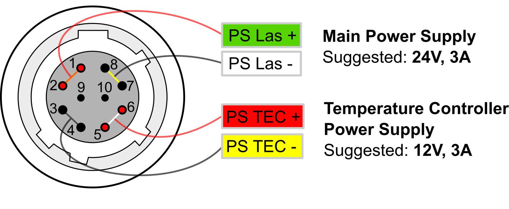
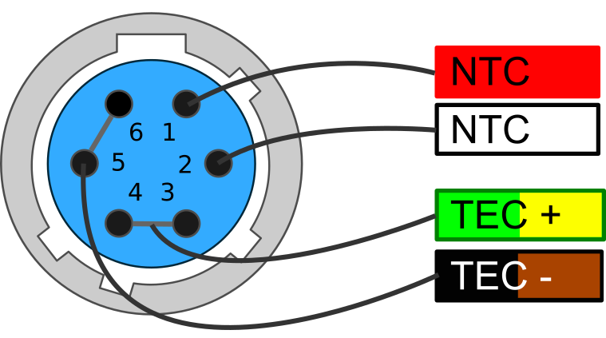

# 4 Introduction

This manual contains information for operating the modular QubeCL system. The QubeCL is a high-performance instrument that provides low-noise and high-ratings electric current and temperature control to drive optoelectronic devices. The QubeCL is particularly suited to drive state of the art semiconductor and Quantum Cascade laser (QCL) sources. This chapter addresses pertinent safety issues and correct usage of this instrument, and defines all front panel connections and LED function indicators. Please, carefully read this chapter before using the QubeCL.

## 4.1 Safety consideration

The QubeCL is a versatile instrument that can be used in a variety of driving current and temperature conditions. However, the QubeCL is not intended for a fail-safe operation in hazardous environments or life-threatening situations. The user assumes full responsibility for correct and safe usage of the QubeCL in accordance with any applicable laws, codes and regulations, and standard pertaining to their specific application. ppqSense S.r.l. is not liable for any consequential damage due to misapplication or failure of the QubeCL system.  
The QubeCL System is compliant with the following standards:

** EN 61326-1, EN 55011, EN 61000-4-2, EN61000-4-8, EN61000-4-3**

## 4.2 Part List

The QubeCL system is shipped in a package designed to provide excellent protection. The shipping box should be saved for future transportation or storage. Carefully unpack and inspect the following items that are contained in the shipping box.

- **QubeCL driver,** built with a variable number and kind of modules depending on the ordered model.

- **Power supply cable.**

- **TC cable,** to connect the temperature controller (only included if the QubeCL mounts a Temperature Controller module).

- **USB cable,** to connect the QubeCL driver to the controlling PC.
- **USB drive,** which contains the required software and drivers.
- **QubePS,** switching power supply for the QubeCL driver, if included in the order.

## 4.3 Electrical power supply

The QubeCL system must be powered by a unipolar **floating** DC power supply. If the QubePS is not included in the QubeCL kit, a dual channel power supply or two different power supplies are necessary to independently drive the Current Generator [CM] and the Temperature Controller [TC] modules.  
**CM** modules must be powered by a DC power supply providing **24 V and at least 3 A** for a versatile usage and for a full compliance to the declared performances and dynamic range.

**TC** modules must be powered by a DC power supply providing **12 V and 4 A,** for a versatile usage and to guarantee performances of the TC module.

User must refer to **Table [11**](#table.caption.24) for minimum, maximum and typical allowable voltages for power supply of the QubeCL. Please, note that using source voltages that differ from the ones indicated as typical , even if in between the maximum and minimum values, may lead to poor calibration of the QubeCL driver or to potentially damaging heat generation.

### DC Input minimum typical maximum

| LAS | +20 V | +24 V | +30 V |  
|---|---|---|---|  
| TEC | +8 V | +12 V | +24 V |  

**Table 11:** Power source voltages specifications

**CAUTION**:

Power supplies used to source the QubeCL drivers must be **floating power supplies.** The terminals of the power supply must not be connected to Earth or to one another in any circumstance.

If the QubePS power supply is included in the QubeCL kit, the user has simply to connect the QubePS to the QubeCL with the dedicated cable delivered within the box. The power cord needed to connect the QubePS to the electrical outlet is not provided.

## 4.4 Connectors and LED indicators functions

A schematic view of the front panel of the QubeCL can be seen in **figure 6.** The image represents a QubeCL15TL, being a QubeCL equipped with a 1.5 A current generator, Tem- perature Controller module and Phase-Locked Loop module. Below, a list of the connectors and LEDs present on the front panel can be found, along with their description: **Connectors:**

- **C1. Power:** power supply connector of the instrument.

- **C2. USB:** this USB port must be used to connect the QubeCL to an host computer in order to control and supervise its operations.

- **C3. TEMP out:** used to connect the supplied TC cable for the temperature control of the driven device. It provides NTC (10 k) temperature sensor input and TEC output (2.7A maximum).

- **C4. CURRENT out:** Output SMA connector. The driver supplies the current through this connector to the controlled laser device. A proper SMA cable must be provided by the user. The output provides a maximum current corresponding to the limits of the installed CM modules of the QubeCL (for example 1.5A for a QubeCL with one CM10 and one CM05 modules), with a maximum output voltage compliance of 17.5 V.

  

---

- **C5/C6. MOD1/2 in:** Input SMA connectors. May be used to source finely controlled modulating signals to the laser current, with the amplitude proportional to the applied control voltages.

**Figure 6:** QubeCL15TP front panel

**LED indicators:**

- **L1. CONNECT:** Green. Switched on when the QubeCL driver is connected to an host PC through its USB port.

- **L2. CUR ON:** Yellow. Switched on when the QubeCL sources current from C4 Current out connector to the controlled laser.

- **L3. MOD ON:** Yellow. Switched on when the modulation signals are enabled.
- **L4. PWR ON:** Green. Switched on when the QubeCL main unit is powered on.

- **L5. TC unlock:** Red. Switched on when the temperature of the controlled device is different with respect to the temperature set-point value.

- **L6. TC lock:** Green. Switched on when the temperature of the controlled device is locked and equal to the temperature set-point value.

The list only comprehends the LEDs and connectors that are present on the majority of the QubeCL possible configurations. A detailed description of PLL module, along with other application-specific modules, can be found further below in this manual.

  

---

## 4.4.1 Power connector

The QubeCL kit comes with a dedicated power supply cable to con- nect the QubeCL to its power supply. One of the ends of the QubeCL power cable is already equipped with a 10 poles connector compatible with the one present on the QubeCL driver (see **figure** 7).  
If the QubePS is provided with the kit, the cable is ready to be directly plugged into the QubePS connector.

**Figure 7:** Power connector pin diagram

Alternatively, when the QubePS is not provided, the cable is equipped with four plugs to be connected to the power supplies.  
The four plugs can be identified as the subsequent ones:

- two for CM power supply (green-labelled PS Las +, white-labelled PS Las -)
- two for TC power supply (red-labelled PS TEC +, yellow-labelled PS TEC -).

## 4.4.2 TEC connector

If the QubeCL is equipped with the TC module, but not with a laser-housing mod- ule, a proper connection with the Peltier- based stage of the laser and with the NTC temperature sensor must be established. The QubeCL kit includes a TEC cable with one of its ends already equipped with the proper connector to be plugged into the TC module.  
The user must adapt the other end of the TEC cable in order to connect it to the laser. Please, refer to the wires colors represented in **figure [8**](#figure.caption.31) to properly connect the TEC ca- ble to the laser.

**Figure 8:** TEC connector pin diagram

# 4.5 QubeCL_Control software installation

Every QubeCL system, regardless of the specific model, can be controlled by the mean of the same Control Software, which comes in the USB key included in the QubeCL kit. The QubeCL\_Control software has been developed under LabView Runtime Environment .

To install the QubeCL\_Control software on Windows OS, please follow these steps. All the needed softwares are provided inside the USB key that comes inside the QubeCL kit.

  

---

- Run the library installation application to install the following libraries and drivers:
- Microcontroller USB-driver (CDM21228\_Setup)
- LabVIEW NI-VISA Utilities (NIVISA1600full)
- Copy the directory " /QubeCL\_CONTROL:vX.X " and all its content in a directory of your choice in the computer.  
More information can also be found in the readme.txt file in the main directory of the USB key.

  

---
