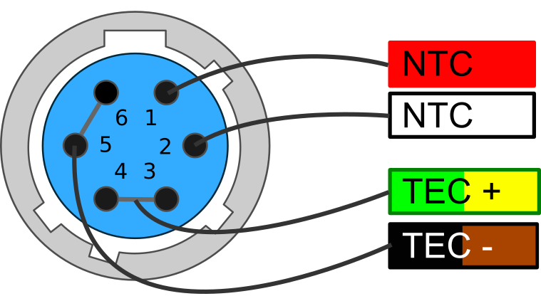
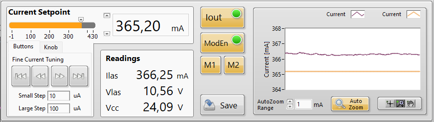
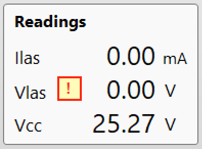
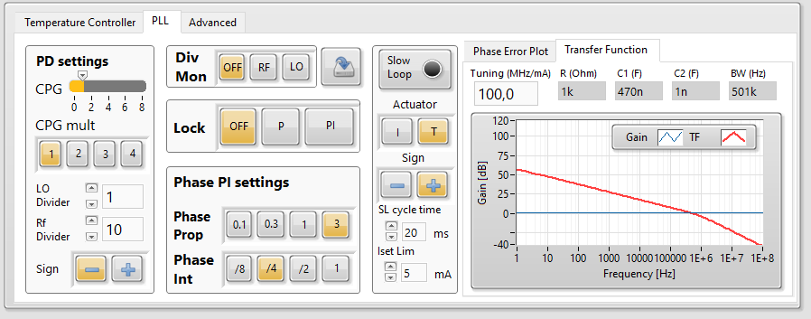

# QubeCL Laser Driver Manual V.5

<!-- *table-of-figures -->

<!-- [TOC] -->
<!-- 
## List of Tables

1  
Communication Interfaces . . . . . . . . . . . . . . . . . . . . . . . . . . . .  
[6](#table.caption.2) 2  
Absolute Maximum Ratings . . . . . . . . . . . . . . . . . . . . . . . . . . .  
[6](#table.caption.3) 3  
Current Generator Specs . . . . . . . . . . . . . . . . . . . . . . . . . . . . .  
6 4  
Analog Current Modulators Specs . . . . . . . . . . . . . . . . . . . . . . . .  
[7](#table.caption.5) 5  
Mixed Current Generator Specs - Digital . . . . . . . . . . . . . . . . . . . .  
7 6  
Mixed Current Generator Specs - Analog . . . . . . . . . . . . . . . . . . . .  
[8](#table.caption.7) 7  
Temperature Controller Specs . . . . . . . . . . . . . . . . . . . . . . . . . .  
8 8  
PLL Module Specs . . . . . . . . . . . . . . . . . . . . . . . . . . . . . . . .  
[8](#table.caption.9) 9  
Pound-Drever-Hall module Specs . . . . . . . . . . . . . . . . . . . . . . . .  
8 10 Lock-In Amplifier module Specs . . . . . . . . . . . . . . . . . . . . . . . . .  
[9](#table.caption.11) 11 Power source voltages specifications . . . . . . . . . . . . . . . . . . . . . . . 14 13 Available commands for QubeCL current generator. . . . . . . . . . . . . . . 57 14 Available commands for QubeCL temperature controller. . . . . . . . . . . . . [58](#table.14) 15 Available commands for the DDS submodule. . . . . . . . . . . . . . . . . . . 60 16 Available commands for the PLL locking module. . . . . . . . . . . . . . . . . [62](#table.16) 17 Available commands for the PDH locking module. . . . . . . . . . . . . . . . 64 18 Available commands for the LIA locking module. . . . . . . . . . . . . . . . . [66](#table.18) 19 Available commands to check the instrument status. . . . . . . . . . . . . . . 67

## List of Figures

1  
Current noise spectral density comparison with low current modulator . . . . . [10](#figure.caption.12) 2  
Current noise spectral density comparison with high current modulator . . . . 10 3  
24h Current stability over ambient temperature . . . . . . . . . . . . . . . . . [11](#figure.caption.16) 4  
24h Current stability over time . . . . . . . . . . . . . . . . . . . . . . . . . 11 5  
Current temperature coefficient . . . . . . . . . . . . . . . . . . . . . . . . . [12](#figure.caption.18) 6  
QubeCL15TP front panel . . . . . . . . . . . . . . . . . . . . . . . . . . . . 15 7  
Power connector pin diagram . . . . . . . . . . . . . . . . . . . . . . . . . . 16 8  
TEC connector pin diagram . . . . . . . . . . . . . . . . . . . . . . . . . . . [16](#figure.caption.31) 9  
QubeCL control software main screen . . . . . . . . . . . . . . . . . . . . . . 19 10 The QubeCL\_Control software configuration panel . . . . . . . . . . . . . . . [20](#figure.caption.41) 11 The QubeCL\_Control software current driver panel . . . . . . . . . . . . . . . 21 12 The QubeCL\_Control software temperature control panel . . . . . . . . . . . [22](#figure.caption.46) 13 The QubeCL\_Control software Advanced tab . . . . . . . . . . . . . . . . . . 23 14 Appearance of the LH module equipped with the DDS sub-module . . . . . . [29](#figure.caption.56) 15 The DDS control panel of the QubeCL\_Control Software . . . . . . . . . . . 30 16 Appearance of the PLL module . . . . . . . . . . . . . . . . . . . . . . . . . 32 17 Control Software Interface dedicated to the PLL Module . . . . . . . . . . . . [33](#figure.caption.66) 18 Appearance of the PDH module . . . . . . . . . . . . . . . . . . . . . . . . . 36 19 Control Software Interface dedicated to the PDH Module . . . . . . . . . . . [37](#figure.caption.77) 20 Appearance of the LIA module . . . . . . . . . . . . . . . . . . . . . . . . . 40 21 Control Software Interface dedicated to the LIA Module . . . . . . . . . . . . [42](#figure.caption.96)
22 The first Advanced tab of the Control Software GUI - 48  
23 The first Advanced tab of the Control Software GUI - 50  
24 Bias Tee simplified electronic diagram - 52  
25 Drawings of the NanoPlus Cubic Mount Interface Board - 55  
26 Drawings of the HHL Interface Board - 55  

---  -->

## 1. Warranty

ppqSense S.r.l. guarantees its QubeCL System to be free of material and workmanship defects for one year from the date of the original shipment **(1-YEAR WARRANTY).** This warranty is in lieu of all other guarantees expressed or implied, including any implied warranty of merchantability or fitness for any particular purpose. ppqSense S.r.l. shall not be liable for any special, incidental or consequential loss. During the warranty period, ppqSense S.r.l. will repair or replace the unit or module, or issue credit, at our option, without charge. ppqSenses liability shall not in any case exceed the cost of correcting defects in the products as explained here, and this service is the sole remedy of the buyer. This warranty does not apply to defects caused by abuse, accident, modifications, Acts of God, or the use of the product for which it was not intended. ppqSense S.r.l. shall not be liable for damages resulting from the use of the product, nor shall be responsible for any failure in the performance of other items to which the purchased product is connected or the operation of any system of which the purchased product may be a part. The QubeCL System should not be used in the manner not specified by the manufacturer.

## 2 Specifications

### 2.1 Communication interfaces

Table: Communication Interfaces{#com-ref}

{{ read_csv('assets_QubeCL_Manual_v5/tables/communication_interfaces.csv') }}

<!-- Table: Communication Interfaces

| **Interface** | **Mode** | **Settings** | **Notes** |  
|---|---|---|---|  
| USB | Virtual Serial Port | 115200 8N1 ||  
| WiFi | Access Point/Client | software configurable | Optional | -->

### 2.2 Absolute maximum ratings

Table: Absolute maximum voltage and temperature ratings

| **Parameter** | **Values** | **Unit** | **Notes** |  
|---|---|---|---|  
| Operating temperature | -20 to +40 | &deg;C ||  
| Storage temperature | -20 to +70 | &deg;C ||  
| Main power supply voltage (PS LAS ) | 26 | V | No terminal must be connected to ground |  
| TEC power supply voltage (PS TEC ) | 24 | V |No terminal must be connected to ground|  
| Modulation inputs | ± 10 | V ||  

### 2.3 Electrical Specifications

$`PS_{LAS}=24V dc, PS_{TEC}= 12 V dc`$

Warm-up time 120 min, room temperature 25 &deg;C (unless otherwise noted) 

**Current Generator Specifications**

Table: Current Generator Specifications

| **Parameter** | **Min** | **Typ** | **Max** | **Unit** | **Notes** |  
|---|---|---|---|---|---|  
| Noise spectral density | 100 | 200 | 500 | pA */* √Hz | test current 200mA |  
| Integrated noise | 50 | 100 | 200 | $`nA_{RMS}`$ | 10 Hz - 100 kHz |  
| Integrated noise | 250 | 350 | 500 | $`nA_{RMS}`$ | 10 Hz - 1 MHz |  
| Stability (1h) | 4 | 5 | 6 | $`ppm_{FS}`$ ||  
| Stability (12h) | 5 | 6 | 7 | $`ppm_{FS}`$ ||  
| Temperature coefficient | -2 | -3 | -5 | $`ppm_{FS}`$ &deg; C ||  
| Voltage compliance || 17.5 || V ||  

---

**Analog Current Modulators Specs**

Table: Analog Current Modulators Specs

| **Parameter** | **Min** | **Typ** | **Max** | **Unit** | **Notes** |  
|---|---|---|---|---|---|  
| Analog input voltage | 0 || ± 10 | V ||  
| DC offset | 20 | 30 | 50 | µA | input shorted |  
| **Low Current**|
| Noise spect. dens. floor | 50 || 100 | pA */* Hz | input shorted |  
| Output current | 0 || ± 5 | mA ||  
| Gain || -0.5 || mA/V ||  
| Modulation BW (-3 dB) || 2 || MHz ||  
| **High current**||||||  
| Noise spect. dens. floor | 200 || 2000 | pA */* Hz | input shorted |  
| Output current | 0 || ± 100 | mA ||  
| Gain || -10 || mA/V ||  
| Modulation BW (-3 dB) || 600 || kHz ||  

---

**Mixed Current Generator Specs - Digital**

Table: Mixed Current Generator Specs - Digital

| **Parameter** | **Min** | **Typ** | **Max** | **Unit** | **Notes** |  
|---|---|---|---|---|---|  
| Waveforms | ||||Sine or Triangle|  
| Freq. range | 10 −3 || 10 6 | Hz ||  
| Min freq. step || 250 || mHz ||  
| Amplitude control res. || 12 || bits ||  
| DC offset | 20 | 30 | 50 | µA | input shorted |  
| **Low current** |  
| Noise spect. dens. floor | 50 || 100 | pA */* Hz | input shorted |  
| Output current | 0 || ± 2 *.* 5 | mA ||  
| Modulation BW (-3 dB) || 2 || MHz ||  
| **High current** |  
| Noise spect. dens. floor | 200 || 2000 | pA */* Hz | input shorted |  
| Output current | 0 || ± 75 | mA ||  
| Modulation BW (-3 dB) || 600 || kHz ||  

---

**Mixed Current Generator Specs - Analog**  

Table: Mixed Current Generator Specs - Analog  

| **Parameter** | **Min** | **Typical** | **Max** | **Unit** | **Notes** |  
|---|---|---|---|---|---|  
| Analog input voltage | 0 || ± 2 *.* 5 | V ||  
| DC offset | 20 | 30 | 50 | µA | input shorted |  
| **Low current** | 
| Noise spect. dens. floor | 50 || 100 | pA / Hz | input shorted |  
| Output current | 0 || ± 2 *.* 5 | mA ||  
| Gain || -1 || mA/V ||  
| Modulation BW (-3 dB) || 2 || MHz ||  
| **High current** |
| Noise spect. dens. floor | 200 || 2000 | pA */* Hz | input shorted |  
| Output current | 0 || ± 75 | mA ||  
| Gain || -30 || mA/V ||  
| Modulation BW (-3 dB) || 600 || kHz ||  

---

**Temperature Controller Specs**  
Table: Temperature Controller Specs  

| **Parameter** | **Min** | **Typical** | **Max** | **Unit** | **Notes** |  
|---|---|---|---|---|---|  
| Thermistor | 1 || 10 | kΩ | NTC |  
| TEC current ||| ± 3 | A ||  
| TEC compl. voltage || 20 || V ||  
| Temp stability || 40 | 400 | µK | absolute stability in 12h |  
| Temp. coefficient || -90 | -100 | µK */* K ||  

**PLL Module Specs**

Table: PLL Module Specs

| **Parameter** | **Min** | **Typ** | **Max** | **Unit** | **Notes** |  
|---|---|---|---|---|---|  
| RF freq. input | 10 || 250 | MHz ||  
| LO freq. input | 10 || 100 | MHz ||  
| Input level | -30 || 0 | dBm ||  
| Input stage gain | 0 || 30 | dB ||  
| Lock bandwidth ||| 800 | kHz ||  

**Pound-Drever-Hall module Specs** 

Table: Pound-Drever-Hall module Specs  

| **Parameter** | **Min** | **Typical** | **Max** | **Unit** | **Notes** |  
|---|---|---|---|---|---|  
| RF freq. input | 1 || 100 | MHz ||  
| LO freq. input | 1 || 100 | MHz ||  
| RF Input level | -30 || 0 | dBm ||  
| LO Input level || 5 || dBm ||  
| Lock bandwidth ||| 800 | kHz ||  

---

 **Lock-In Amplifier module Specs**

Table: Lock-In Amplifier module Specs

| **Parameter** | **Min** | **Typical** | **Max** | **Unit** | **Notes** |  
|---|---|---|---|---|---|  
| Demodulation frequency || 32768 || Hz | fixed |  
| Ramp frequency | 1 || 1000 | Hz ||  
| Input voltage noise || 30 || µV  RMS ||  
| Input stage gain | 0 || 60 | dB ||  
| Integration time | 1 || 10000 | ms ||  
| Lock bandwidth ||| 1 | kHz ||  

---

## 3 Typical performance characteristics

---

## 4 Introduction

This manual contains information for operating the modular QubeCL system. The QubeCL is a high-performance instrument that provides low-noise and high-ratings electric current and temperature control to drive optoelectronic devices. The QubeCL is particularly suited to drive state of the art semiconductor and Quantum Cascade laser (QCL) sources. This chapter addresses pertinent safety issues and correct usage of this instrument, and defines all front panel connections and LED function indicators. Please, carefully read this chapter before using the QubeCL.

### 4.1 Safety consideration

The QubeCL is a versatile instrument that can be used in a variety of driving current and temperature conditions. However, the QubeCL is not intended for a fail-safe operation in hazardous environments or life-threatening situations. The user assumes full responsibility for correct and safe usage of the QubeCL in accordance with any applicable laws, codes and regulations, and standard pertaining to their specific application. ppqSense S.r.l. is not liable for any consequential damage due to misapplication or failure of the QubeCL system.  

The QubeCL System is compliant with the following standards:

**EN 61326-1, EN 55011, EN 61000-4-2, EN61000-4-8, EN61000-4-3**

### 4.2 Part List

The QubeCL system is shipped in a package designed to provide excellent protection. The shipping box should be saved for future transportation or storage. Carefully unpack and inspect the following items that are contained in the shipping box.

- **QubeCL driver,** built with a variable number and kind of modules depending on the ordered model.

- **Power supply cable.**

- **TC cable,** to connect the temperature controller (only included if the QubeCL mounts a Temperature Controller module).

- **USB cable,** to connect the QubeCL driver to the controlling PC.
- **USB drive,** which contains the required software and drivers.
- **QubePS,** switching power supply for the QubeCL driver, if included in the order.

### 4.3 Electrical power supply

The QubeCL system must be powered by a unipolar **floating** DC power supply. If the QubePS is not included in the QubeCL kit, a dual channel power supply or two different power supplies are necessary to independently drive the Current Generator [CM] and the Temperature Controller [TC] modules. 

**CM** modules must be powered by a DC power supply providing **24 V and at least 3 A** for a versatile usage and for a full compliance to the declared performances and dynamic range.

**TC** modules must be powered by a DC power supply providing **12 V and 4 A,** for a versatile usage and to guarantee performances of the TC module.

User must refer to  for minimum, maximum and typical allowable voltages for power supply of the QubeCL. Please, note that using source voltages that differ from the ones indicated as typical , even if in between the maximum and minimum values, may lead to poor calibration of the QubeCL driver or to potentially damaging heat generation.

Table: Power source voltages specifications{#pwr_specs}

|DC Input |minimum |typical | maximum |
|---|---|---|---|
| LAS | +20 V | +24 V | +30 V | 
| TEC | +8 V | +12 V | +24 V |  

!!! Warning "CAUTION: Floating Power Supplies Only"

    Power supplies used to source the QubeCL drivers must be **floating power supplies.** The terminals of the power supply must **not** be connected to Earth or to one another in any circumstance.
  

If the QubePS power supply is included in the QubeCL kit, the user has simply to connect the QubePS to the QubeCL with the dedicated cable delivered within the box. The power cord needed to connect the QubePS to the electrical outlet is not provided.

### 4.4 Connectors and LED indicators functions

A schematic view of the front panel of the QubeCL can be seen in . The image represents a QubeCL15TL, being a QubeCL equipped with a 1.5 A current generator, Tem- perature Controller module and Phase-Locked Loop module. Below, a list of the connectors and LEDs present on the front panel can be found, along with their description: **Connectors:**

- **C1. Power:** power supply connector of the instrument.

- **C2. USB:** this USB port must be used to connect the QubeCL to an host computer in order to control and supervise its operations.

- **C3. TEMP out:** used to connect the supplied TC cable for the temperature control of the driven device. It provides NTC (10k) temperature sensor input and TEC output (2.7A maximum).

- **C4. CURRENT out:** Output SMA connector. The driver supplies the current through this connector to the controlled laser device. A proper SMA cable must be provided by the user. The output provides a maximum current corresponding to the limits of the installed CM modules of the QubeCL (for example 1.5A for a QubeCL with one CM10 and one CM05 modules), with a maximum output voltage compliance of 17.5 V.

- **C5/C6. MOD1 / 2 in:** Input SMA connectors. May be used to source finely controlled modulating signals to the laser current, with the amplitude proportional to the applied control voltages.

Figure: QubeCL15TP front panel

{#front_panel}

**LED indicators:**

- **L1. CONNECT:** Green. Switched on when the QubeCL driver is connected to an host PC through its USB port.

- **L2. CUR ON:** Yellow. Switched on when the QubeCL sources current from C4 Current out connector to the controlled laser.

- **L3. MOD ON:** Yellow. Switched on when the modulation signals are enabled.
- **L4. PWR ON:** Green. Switched on when the QubeCL main unit is powered on.

- **L5. TC unlock:** Red. Switched on when the temperature of the controlled device is different with respect to the temperature set-point value.

- **L6. TC lock:** Green. Switched on when the temperature of the controlled device is locked and equal to the temperature set-point value.

The list only comprehends the LEDs and connectors that are present on the majority of the QubeCL possible configurations. A detailed description of PLL module, along with other application-specific modules, can be found further below in this manual.  

---

### 4.4.1 Power connector

The QubeCL kit comes with a dedicated power supply cable to con- nect the QubeCL to its power supply. One of the ends of the QubeCL power cable is already equipped with a 10 poles connector compatible with the one present on the QubeCL driver (see ).  
If the QubePS is provided with the kit, the cable is ready to be directly plugged into the QubePS connector.

Figure: Power connector pin diagram

{#pwr_connector}

Alternatively, when the QubePS is not provided, the cable is equipped with four plugs to be connected to the power supplies.  
The four plugs can be identified as the subsequent ones:

- two for CM power supply (green-labelled PS Las +, white-labelled PS Las -)
- two for TC power supply (red-labelled PS TEC +, yellow-labelled PS TEC -).

---

### 4.4.2 TEC connector

If the QubeCL is equipped with the TC module, but not with a laser-housing mod- ule, a proper connection with the Peltier- based stage of the laser and with the NTC temperature sensor must be established. The QubeCL kit includes a TEC cable with one of its ends already equipped with the proper connector to be plugged into the TC module.  
The user must adapt the other end of the TEC cable in order to connect it to the laser. Please, refer to the wires colors represented in  to properly connect the TEC ca- ble to the laser.

Figure: TEC connector pin diagram

{#TEC_Connector}

---

## 4.5 QubeCL_Control software installation

Every QubeCL system, regardless of the specific model, can be controlled by the mean of the same Control Software, which comes in the USB key included in the QubeCL kit. The QubeCL_Control software has been developed under LabView Runtime Environment .

To install the QubeCL_Control software on Windows OS, please follow these steps. All the needed softwares are provided inside the USB key that comes inside the QubeCL kit.

### Installation Steps

- Run the library installation application to install the following libraries and drivers:
  - Microcontroller USB-driver (CDM21228_Setup)
  - LabVIEW NI-VISA Utilities (NIVISA1600full)
- Copy the directory " /QubeCL_CONTROL:vX.X " and all its content in a directory of your choice in the computer.  
- 
*More information can also be found in the readme.txt file in the main directory of the USB key.*

---

## 5 Basic operation: current and temperature controls

This chapter explains the typical set-up and operation of a QubeCL system composed by a CM module (or a stack of several of them) and a TC module. This chapter should help less experienced users to rapidly adapt the QubeCL system to drive their specific optoelectronic devices. Keep in mind that not all the possible operations of the QubeCL system with a specific controlled device can be adequately addressed in this manual: these are general guidelines for operating a QubeCL system with specific illustrative examples. Adequate parameter values must be considered by the users when controlling a specific device.  
The QubeCL is built with a modular approach, with each module being in charge of performing a specific function. This chapter describes the usage of a QubeCL which includes one CM and one TC module. The functions of those modules are, respectively:

- To provide a **very low-noise and high-level DC current** to drive one optoelectronic device;
- To provide the optoelectronic device **temperature stabilization** at a few mK level.

### 5.1 Set-up

The typical set-up to operate with a QubeCL system is composed by the QubeCL itself, the laser device, a DC power supply and a PC for overall control.  
To correctly operate with the QubeCL, the following step must be followed:

- If the QubeCL kit includes a QubePS power supply, simply connect the QubeCL to the QubePS with the dedicated cable available in the kit.  
Otherwise, if the QubePS is not included:
- Set the voltage values of the **floating** power supplies you’re using following the indication from the [dedicated section](#43-electrical-power-supply) of this manual.
- Connect the QubeCL to the power supply by the mean of the provided cable  
∗ Connect TEC+ and TEC- to the +/- poles of the power supply selected channel for electrical supply of the TC module, respectively.  
∗ Connect LAS+ and LAS- to the +/- poles of the power supply selected channel for electrical supply of the CM module(s), respectively.

!!! Warning "RESPECT THE POLARITY"

    If not using a QubePS be sure to **RESPECT THE POLARITY** of the power supply cable. **REVERSE** voltages will damage the instrument.  
    In case you’re not using a dual-channel power supply, but two different power supplies, please switch on the TC supply before the CM supply otherwise the QubeCL won’t boot correctly.

- Connect the provided power supply cable to the C1 connection of the main unit module of the QubeCL system;

- Connect the provided USB cable to the C2 connection of the main unit module of the QubeCL system;

- Connect the provided TC cable, properly wired to the laser, to the C3 connector of the TC module of the QubeCL system.  

**N.B.** This operation is not necessary if the QubeCL includes a laser housing module;

- Connect the user provided laser device current cable to the SMA C4 connector of the LH module of the QubeCL system.  
**N.B.** This operation is not necessary if the QubeCL includes a laser housing module;

- **Optional:** connect a signal generator(s) to the modulation inputs of the QubeCL (SMA C5-C6 connectors of the LC module).

### 5.2 Operating with the Control Software

In this section the usage of the Control Software to manage the basic operation of the QubeCL is described in detail.

**Figure 9:** QubeCL control software main screen

  

---

### 5.2.1 Connecting to the QubeCL

To use the QubeCL\_Control software, locate the directory where you’ve previously placed  
the QubeCL\_CONTROL:vX.X folder from the USB key and launch the QubeCL\_Control\_vX.X.exe application.  
A graphical interface as the one showed in **figure [9**](#figure.caption.37) will be displayed. While the program search  
for connected QubeCLs to the computer, a progress bar will be displayed. Once the search  
is done, it will be possible to select the desired QubeCL from the **INSTRUMENT ADDR** drop-down menu. Once selected, launch the program by pressing the CONNECT button.

If the program fails to detect any connected QubeCL, an error windows as the one shown here pops up. From there it will be possible to stop the program with the **EXIT** button or manually select a connected driver by the COM port to which it is connected.

### 5.2.2 QubeCL_Control appearance

The GUI of the control software is subdivided into three main horizontal panels:

**Figure 10:** The QubeCL\_Control software configuration panel

The **Configuration panel** at the top **(Figure 10),** there can be found:

- **INSTRUMENT** menu: allows the selection of the QubeCL that the user wants to connect to. The connection can be established only at the start-up of the program, it is not possible to switch to another QubeCL instrument without restarting the control software.

- **CONNECT** and **DISCONNECT** buttons: allow the connection and disconnection to the selected QubeCL. **DISCONNECT** also stops the program.

- **CURRENT LIMIT** menu: by pressing this button, another window will be displayed, allowing the user to change the maximum limit for the current that the QubeCL can deliver to the laser.

- **System information** menu: shows some information about the QubeCL to which the software is connected, such as firmware version, instrument model and serial number.

- **Power ON** indicators: above the CONNECT and DISCONNECT buttons, two LEDs show the status of the power source to the CM (called MAIN) and TC modules.

  

---

The **Current driver panel** is the middle one **(Figure 11),** there can be found:

- **Current setpoint:** from there, the user can change the current that needs to be sourced by the QubeCL to the laser. Three different controls allow the user to change this value:

- A numerical value expressed in mA can be directly typed into the dedicated form;

- A horizontal slider, to the left of the numerical value, can be used to set the current;

- Four buttons can be used to increment or decrement the current by fixed steps. The desired amplitude for the steps can be typed in the two dedicated forms below the arrow buttons.

- **Iout** button: enables/disables the current output of the QubeCL.  
This button includes a green LED indicator. This LED is switched ON when the QubeCL is delivering current to the laser. Once the user switches off the current, the button becomes gray and the QubeCL gradually lowers the current sourced to the laser until it is completely switched off. The LED will be switched off only when the current is.

- **Mod En** button: enables/disables all the modulation channels;

- **M1** and **M2** buttons: activate/deactivate the modulation channels built on board of the QubeCL. By enabling those channels, modulating currents can be injected over the bias current;

- **Save** button: saves the parameters currently set in this panel to the ROM memory of the QubeCL. Those values will be recalled from the memory at the next startup of the QubeCL driver;

- **Readings** window: shows the values of the output current ( Ilas ) and voltage ( Vlas ) as well as the supply voltage ( Vcc );

- **Current plot:** shows the temporal behaviors of the set current (orange trace) and the actual output current (purple trace). This plot won’t show any modulation signal that may be applied to the output current.

**Figure 11:** The QubeCL\_Control software current driver panel

  

---

The **Temperature control panel** at the bottom **(Figure 12),** where the subsequent com- mands can be found:

- **Temp. SetPoint:** sets the desired operating temperature for the laser, expressed in °C.

- **Temp. Read:** returns the value of the temperature measured on the laser using its NTC sensor, expressed in °C.

- **TStab** button: turns on/off the temperature stabilization of the laser.

- **Loop sign +/-** button: allows the user to change the sign of the temperature stabi- lization loop, effectively switching its behavior from heating to cooling and vice versa.

- **Temperature PID parameters** panel: the TEC module stabilizes the temperature of the laser by the mean of a PID correction loop. This window allows the user to change the values of the three functional parameters of the PID, both with sliders and textual inputs. Detailed instruction can be found below.

- **Save** button: saves the setpoint, loop sign, PID gains and Tstab status on the ROM memory of the QubeCL so that they can be used as default at next switch on.  
**N.B.** This command also saves the status of Tstab, hence if the Save button is pressed when the temperature stabilization is active, the QubeCL will automatically start to stabilize the temperature once it gets powered up. If this behavior is unwanted, Save button must be pressed when the temperature stabilization is inactive.

- **Temperature and TEC current** plots: switching from one to another, the user can have a look over the temporal behavior of the readed and setpoint temperatures of the laser and of the current erugated by the TC module.

**Figure 12:** The QubeCL\_Control software temperature control panel

  

---

### 5.3 Operation

Once the QubeCL has been correctly set-up, the effective operations can begin following the steps listed below:

- Turn on the **floating** power supply (or the QubePS if it is comprised in the kit) to supply the instrument.  
LED L4 (green) lights on.  
LED L5 (red) lights on, meaning that the laser temperature is not stabilized. If the TC parameters where saved with active temperature stabilization, the QubeCL will automatically start to stabilize the temperature. If it manages to do so, L5 switches off and L6 (green) switches ON.

- Once you connect the USB cable to the QubeCL, LED L1 (green) switches ON.

- Start the QubeCL\_control program, wait until it detects the connected QubeCL(s), chose the one you want to connect to and press the blinking **CONNECT** button.

- The first thing to do when starting to work with a new set-up, is to set all the safety parameters offered by the QubeCL:

- In the configuration panel, set the **maximum current limit** following the max- imum current limit indicated in your laser device datasheet and/or test report. Once set, if the user tries to set a current higher than this maximum value, the software will cap it to the maximum value.

- In the TC Advanced section of the Advanced **tab(Figure 13),** that can be found in the lower panel, use the **TEC limit** control to set the **maximum current** that the TC controller may source to the Peltier stage. To do so, you must press the correspondent **CHANGE** button.

**Figure 13:** The QubeCL\_Control software Advanced tab

Once the safety values are set, the user may start to operate the QubeCL.  
Before turning on the current driver, it is necessary to stabilize the temperature of the laser. This can be done by the QubeCL if the TC module is included in the device configuration.

  

---

### 5.3.1 Temperature control operation

This sequence of operation has to be performed only if the QubeCL houses a TC module, being in charge of temperature stabilization of the laser. All the necessary controls can be found in the **Temperature Controller** tab, in the lower panel of the GUI.

- In the **Temp SetPoint** form, set the temperature at which the laser device has to be stabilized. QubeCL accepts value with a precision down to the second decimal place. The temperature setpoint can be changed at any time during the operations.

- Set the **I** and **D** parameters of the PID controller to 0.0 and **P** to a middle value.
- Press the **Tstab** button to activate the temperature stabilization:

- Once done, TStab button turns orange, **LED L5 lights red** indicating that the desired temperature has not been reached yet.

- At first, **check the temperature plot** on the GUI, if the measured temperature drifts towards the desired setpoint, the sign of the loop is the correct one. Other- wise, if the measured temperature drifts away from the setpoint, it is necessary to switch the sign of the loop using the dedicated **sign buttons.**

- **Increase the I gain** searching for an oscillating behavior of the measured temper- ature around the setpoint. Tstab button will become green each time the measured temperature stays in a range of 20 mK around the setpoint. Similarly, LED L5 will turn off and LED L6 will turn on in this range.

- **Adjust P and I parameters** trying to reduce the oscillating behavior as much as possible, while also reducing the time needed to the measured temperature to converge to the setpoint. At last, TStab must be constantly green, LED L5 turned off and LED L6 turned on.

Once the Temperature Controller parameters have been set to the optimal ones, it is possible to store them in the QubeCL ROM memory using the **Save button** in the Temperature Controller tab to have them as default from now on. Remember that the save button will also store the stabilization status, meaning that if the Temperature Controller were active while saving, it will automatically start to stabilize the laser once the QubeCL is switched on again.

To operate the Temperature Controller at best of its performance, please keep in mind the following characteristics:

- If the heatsink of the laser is unable to dissipate enough heat, its temperature will gradually raise. If so, the Temperature Controller will have to correct an increasing temperature difference, being forced to constantly, even if slowly, increase its current output, eventually reaching the **maximum value.** Once reached, the Temperature Controller will be unable to further stabilize the temperature of the laser.  
To avoid this behavior, it is sufficient to check if the current sourced by the temperature controller is not constantly drifting towards one of its maximum values. Otherwise, a better heat management would be necessary.

  

---

- The Temperature Controller includes a **safety behavior** in order to avoid to operate with a not stabilized laser for long time. Once the temperature stabilization is activated, the Controller constantly check the difference between the measured temperature and the setpoint. At each check, the difference is summed to the previoulsy measured ones. If the measured temperature crosses the setpoint, the sum is set back to 0.  
If the sum goes over a certain threshold, the Temperature Controller **raises an error,** meaning that is was not capable of stabilize the laser Temperature. The threshold can be chosen with the **ErrorSumLim** parameter which is present in the **Advanced Tab.** This limit can be increased if it is too short and causes errors to be raised even when the Controller is converging toward stabilization. An higher threshold would nevertheless increase the time before an error raises when the Temperature Controller is effectively failing to stabilize the laser temperature.

### 5.3.2 Current control operation

Once the laser temperature is stabilized, the user can start to source current to it. The necessary controls are grouped together in the current driver panel of the GUI.

- The desired current value can be typed into the form present in the **Current Setpoint** section of the panel. The value of the current setpoint can also be changed with the up and down arrows or with the slider close to the form.  
The buttons and the knob in the **Fine Current Tuning** tab enable the user to finely control the current setpoint value.  
The Output Current setpoint may be changed at any moment during the operations.

- Once the setpoint is set, the current generator can be switched on by pressing the **Iout button.** A click noise must be heard coming from the QubeCL, while the sourced current plotted on the GUI (purple line) gradually rises towards the setpoint (orange line).  
The QubeCL constantly monitors the value of the current sourced to the laser and the value of the voltage across the laser. The two values are shown in the **Readings** panel along with the **Power Source** voltage monitor.

- If a modulation of the laser current is needed, it can be applyed by enabling the **ModEn** button, which in turn will give the user the ability to switch on the **M1** and **M2** buttons. In order for the modulation to be sourced to the laser, there must be a modulating signal connected to the dedicated inputs of the QubeCL or a signal generated by an onboard DDS module. This matter is examined in detail in a subsequent chapter.  
The **ModEn** button is not active for 10 seconds starting from the current being switched on, so that the modulations can be applied only when the current to the laser is stable. Modulations will be automatically switched off when the current is.

The parameters for the Current Generator can be stored in the ROM memory of the QubeCL to be used as default when the QubeCL is switched on by clicking the **Save button.** Unlike the Temperature Controller, save button of the current control panel **will not save the Current Generator status,** hence the QubeCL never automatically starts to source current to the laser when it gets switched on.

  

---

### 5.3.3 Automatic protections

QubeCL continuously monitors a variety of functional parameters both of the laser and of the QubeCL driver itself. The data acquired allows the QubeCL to implement a series of automatic protections to operate as safe as possible, avoiding damage to the QubeCL and, most importantly, to the laser device.  
The QubeCL driver implement the following protection for the Current Generator:

**Open-circuit protection:** this safety measure con- stantly checks if the electrical connection with the laser is still present, otherwise the Current Gener- ator is immediately switched off and the QubeCL output is shorted.  
If this condition is detected, a blinking warning sig- nal appears on the GUI, next to the Vlas indicator in the Readings box of the Current Generator panel.

**Compliance Limit reached:** the same warning described above is raised if the QubeCL senses a voltage across the laser higher than the maximum allowed compliance voltage. Such Compliance Limit [CL] voltage depends on the nominal Source Voltage for the Current Gen- erator and can be obtained as CL = (0.77 · Vcc) - 1.

**Low Voltage Supply protection:** if the CM mod- ule supply voltage falls below 18.5 V, the QubeCL automatically switches off the current and shorts the output connector.  
A blinking warning signal appears on the GUI, next to the Vcc monitor in the Readings panel.

The previously described errors will not be deasserted if the warning condition is not met anymore (for example, if the Supply Voltage raises again above 18.5 V). This behavior has been implemented to avoid the warning to go unnoticed in case the user were not monitoring the GUI or the QubeCL\_Control program were not running when the error condition happened. Once the cause of the error condition has been eliminated, the user can reset the errors by switching on the current generator.

  

---

The QubeCL also monitors the temperature of the laser, implementing some safety features to prevent potentially dangerous conditions:

**TEC module communication fault:** if some problem oc- curs to the communication with the TEC module (i.e. when the module is not properly powered) the Temp Read value becomes -273 °C, and a warning box appears next to it (see Figure at right). The warning disappears as soon as the com- munication with the TEC is re-established.

**Temperature sensor fault:** in case the temperature sensor is not working properly (i.e. it is not connected to the TEC module), the Temp Read value becomes -67.737 °C and the warning square box appears next to the readed value.  
In case one of the above problems occur when the Temper- ature Stabilization is active, a warning box appears also next to the Temp Read line. If the QubeCL is sourcing current to the laser when a Temperature Controller fault is detected, the current source is disabled to prevent damage to the laser.

**Temperature stabilization problem:** if, for any reason, the Temperature Controller modules fails to stabilize the laser temperature (i.e. wrong PID sign, poor heat management), the QubeCL disables both Temperature Stabilization and Cur- rent output to the laser. A warning box appears next to the Temp Read line.  
The threshold above which a Temperature stabilization is raised can be changed by acting the **Error Sum Lim** pa- rameter in the Advanced tab, as previously described.

  

---

## 6 Advanced Operations - Modulators and DDS

Besides the basic functionality, QubeCL may perform a variety of advanced operations while driving a laser device. As well as the basic functions, the advanced ones are performed by dedicated modules.  
The laser Head (LH) module is the one deputed to the connection to an external laser and, besides providing all the necessary switches and safety features, it also includes two **current** modulator circuits.

The modulator circuits onboard of the LH are capable of directly injecting current to the laser, superimposing their output signal over the DC bias current sourced by the Current Generator. The modulating current signal generated by the modulators is proportional to the input signal that is applied to the dedicated inputs on the LH module. If we denote the modulation current with *Imod* , the input control voltage with *Vin* and the absolute value of the gain in *mA/V* with *G* , the modulation current is equal to:

*Imod* = −G · *Vin* .

This means that a **positive control voltage will subtract current** from the laser bias current while a **negative control voltage will add** the modulating current to the DC bias. The two modulators can be activated ad the same time, in which case their output signals would arithmetically add together.  
The two modulators are built in order to cover all the possible needs that may arise while driving a laser:

- **Low current modulator:** this modulator has a lower V/I Gain. It allows the user to modulate the bias current with signals down to tens of nA with great precision and low added noise.

- **High current modulator:** this modulator has higher Gain, allowing to modulate the Bias current with signals up to tens of mA, allowing the user to perform large scans.

The gain values for the two modulators can be found in the QubeCL datasheet and in the test report that comes along with the instrument.

!!! Warning "CAUTION: Current Overload Risk"

    The high current modulator can provide currents up to tens of mA which can be added to or subtracted from the bias current of the laser.  
    When sourcing negative control voltages to the modulators, the modulating current is added to the bias current, in this case the total current may exceed the maximum current allowed by the laser. Therefore it is necessary to be very careful to avoid the risk of damaging the laser itself.  

The maximum current value that the user can set on the QubeCL does not comprehend the modulating signal, being just referred to the sourced Bias Current. The QubeCL does not perform any safety check on the overall Output Current value resulting as the Bias Current with the superimposed modulation signals.

---

Figure: Appearance of the LH module equipped with the DDS sub-module

### 6.1 The DDS sub-module

The LH module may host a smaller sub-module, namely the **DDS sub-module.** DDS stands for Direct Digital Synthesis, being a digitally controlled electronic circuits capable of generating analog signals with the ability of controlling some of their parameters (being Amplitude, Frequency, Phase and Waveform).  
This sub-module adds two DDS circuits to the LH module, enabling the QubeCL to generate its own modulating signals without needing an external signal generator connected to the Modulation inputs. Since the DDS sub-module is housed inside the LH module, it won’t modify the physical dimensions of the QubeCL driver.  
The generated signals are directly injected into the DC bias current similarly to the signals from the externally sourced modulators.  
When the QubeCL also includes a **PDH** or **LIA** module, the DDS sub-module is capable of interacting with them, providing all the synchronous signals that are necessary for those two modules to perform their operations. For more information, please check the chapters dedicated to the PDH and LIA modules.

### 6.1.1 Connectors

The presence of the DDS sub-module adds some feature to the QubeCL and consequently some minor modification to the LH module interconnections are present.  
The three standard connectors previously described are still present, but the connector **C7** is added on the left side of the module, as it is shown in **Figure 14.** C7** is an output SMA connector. The DDS module is capable of generating a **5 V square- wave** synchronization signal which is sourced from the low impedance output on C7. The user may chose to synchronize this signal both to the waveform sourced by DDS1 or to the waveform sourced by DDS2.

### 6.1.2 Control Software interface

The QubeCL \_Control Software includes a section dedicated to the control of the DDS module functionalities. The section can be accessed in the lower part of the GUI by selecting the DDS tab , which is shown in **Figure 15.**  
The DDS control tab is subdivided into three panels:

- The **Sync. Channel** panel includes the controls for the external synchronization signal.

- The **Channel 1** and **Channel 2** panels include all the interfaces to properly control the characteristics of the signal generated by the two DDS circuits.

  

---

**Figure 15:** The DDS control panel of the QubeCL\_Control Software

The **Sync. Channel** panel allows the user to select to which DDS the external synchroniza- tion channel must be synchronized. To do so, the GUI shows the **Sync. frequency** selector. Below the selector, a read-only form shows the actual frequency of the synchronization signal, which is equal to the one of the selected DDS channel.

Above the Sync. Channel panel, the **Save param.** button allows the user to store the current parameters into the ROM memory of the QubeCL so that they can be restored at the next switch on of the driver.

The **Channel 1** and **Channel 2** panels contain the same controls, replicated for the two DDS circuits:

- **ENABLE:** this button activates the DDS circuit, sourcing the synthesized signal to the laser. Note that the DDS circuits share the same signal paths of the external modulators, hence it is necessary to **activate the modulators** from the Current Control panel in order for the DDS signal to be sourced to the laser.

- **WAVEFORM:** this control allows the user to chose the waveform of the signal synthe- sized by the DDS circuit. The available options are **Sine** wave and **Triangular** wave.

- **AMPLITUDE:** this form allows the user to set the peak-to-peak amplitude of the modulating signal, expressed in mA. The value can also be modified by using the up and down arrows next to the form.

- **FREQUENCY:** allows the user to set the frequency of the modulating signal.
- **PHASE:** allows the user to set the phase of the modulating signal.

  

---

### 6.1.3 DDS operations

To operate with the DDS module, follow the steps listed below:

- Activate the Temperature Controller (if present) and the Current Generator as previously described in this manual. Wait until it is possible to interact with the Modulation Enable controls on the Current Control panel.

- Activate the overall **Modulation Enable** button and the enable(s) for the desired mod- ulation channel(s).

- In the DDS tab, set the desired parameters for the modulating signal (Amplitude, Fre- quency, Phase, Waveform) and activate the DDS with the **ENABLE** button.  
Even when the DDS sub-module is present, it is still possible to modulate the laser cur- rent with the external modulators. The internally generated signal(s) and the externally applied one(s) will be added together and injected over the DC bias current.

- The parameters of the synthesized signal can be changed at any time during the oper- ation.

- If needed, the **External Synchronization Signal** can be used as a trigger source for an oscilloscope, to synchronize its acquisition with one of the DDS generated signals.

- Disable the DDS-generated signal by deactivating the corresponding **ENABLE** button when it’s not needed anymore.

Detailed instructions on how to use the DDS sub-module in pair with the PDH or LIA modules, if present, can be found in the respective chapters.

  

---

## 7 Advanced Operations - PLL module

The PLL module gives to the QubeCL instrument the capability of easily perform a complex task such as the **phase-lock of the controlled laser frequency to a reference source.** The PLL module requires two input signals: the **radio-frequency** ( RF ) signal generated by the beatnote between the controlled laser and the reference laser and the **signal from a Local** **Oscillator** ( LO ) used as a set-point for the RF signal.  
When the PLL is activated, a current proportional to the phase error signal is processed by a **Proportional-Integral** ( PI ) stage and internally added to the bias current in order to close the phase-stabilization loop.  
The RF and LO frequencies can be divided by an integer value by the mean of a frequency divider, in order to obtain two signal with similar frequencies at the input of the internal phase-detector. Each divider can be independently set using the Control Software , while the two divided signals can be monitored on the **DIVIDER MON** output ( C10 ). When the loop is activated, the **PHASE mon** output ( C11 ) provides a real-time replica of the phase-error signal after the PI stage.

Since each laser can only be locked to a reference at a time, in this case another laser wavelength, the PLL Module can not be used with other Locking Modules ( LIA , PDH ) on the same QubeCL system.

### 7.1 Connectors

**Figure 16:** Appearance of the PLL module

**C8. RF in**  
Signal level :  
**C10. DIVIDER** Requires 50 Ω load

> intput

- dBm 0 dBm **mon**  
AC coupled. bandwidth : output  
10 MHz 300 MHz

**C9. LO in**  
Signal level :  
**C11. PHASE mon** Requires Hihg-Z load.

> intput

- dBm 0 dBm output  
DC coupled. bandwidth : Range : 10 MHz 300 MHz
- V / 1 V

### 7.2 Control Software Interface

The QubeCL Control Software has a dedicated section for the control and monitor of the PLL Module, it can be accessed by clicking on the PLL tab in the lower portion of the GUI.

  

---

As can be seen in **figure 17,** the panel dedicated to the PLL module is divided into two main areas: on the rightmost part there are two panels named Phase Error Plot and Transfer Function which in turn show the actual error signal monitored by the PLL module and the transfer function implemented by the PI loop mounted on the module itself with the current parameters. The remaining part of the panel is dedicated to all the controls available for the user to control the behavior of the PLL Module.

**Figure 17:** Control Software Interface dedicated to the PLL Module

The controls for the PLL module are subdivided into categories based on their functionality. The **Phase Detector Settings** panel gives the user access to the controls for the Phase Detector:

- **CPG:** sets the output gain for the Phase Detector, has a range between 1 and 8. It has a proportional effect on the transfer function of the module.

- **GPG mult:** works as a multiplier for the CPG control, the total proportional gain introduced is the product of the two.

- **LO Divider:** sets the frequency division factor (integer) for the Local Oscillator signal.

- **RF Divider:** sets the frequency division factor (integer) for the RF input signal (e.g. the beatnote).

- **Sign:** sets the sign of the PI correction loop.

The **Divider Monitor** panel gives the user the ability to chose what signal will be sourced to the Division Monitor Output connector (C10). When in **OFF** position, no signal will be available. The other two buttons allow to chose between the post-divisor **Local Oscillator** signal or the post-divisor **RF** signal, so that the user can visualize the actual frequency of the two signal once they’ve been divided.

  

---

The **Lock** panel allows the user to chose the functional mode of the correction PI loop of the PLL module. There are three possible options:

- **OFF:** the PI loop is not working and does not add any correction signal to the laser current.

- **P:** the loop works in Proportional mode, only the proportional gains affect the output correction signal.

- **PI:** the loop work with both Proportional and Integrative components, being fully en- abled.

On the central bottom part of the tab, the **Phase PI settings** allow the user to control the PI loop gains:

- **Phase Prop:** sets the Proportional Gain of the PI loop.
- **Phase Int:** sets both the Integrative Gain of the PI loop and the high frequency cut-off.

The **Transfer Function** plot gets automatically updated each time that any of the previously mentioned control is changed, with the exception of the Division Monitor which does not affect the transfer function of the PI loop. For a correct visualization of the loop, the user must input the laser Frequency tuning into the dedicated form on the plot panel.

The **Phase Error Plot** shows the real time value of the phase error. The sampling rate is low, hence it will not be helpful with fast moving signals, but can give the user and easy way to monitor the time evolution of this signal during the locking.

### 7.3 PLL Operation

For a proper set-up and use of the PLL module, please follow the steps listed below:

- Check that the Beatnote ( RF ) signal has a level between -30 dBm and 0 dBm and a frequency between 0 and 300 MHz. This signal must be connected to the **RF IN** ( C8 ) conenctor.

- Use a function generator to generate a Local Oscillator signal with a level close to 0 dBm and a frequency between 10 MHz and 100 MHz. This signal must be connected to the **LO IN** ( C9 ) connector.

- Set both **LO divider** and **RF divider** to 1.

- Connect the **DIVIDER MON** output connector ( C10 ) to an oscilloscope with a 50 Ω termination. By using the **Div Mon** control, switch the signals that have to be sourced on this port. The output signal must be a clean square wave with the same frequency of the selected input signal **(RF** or **LO).**  
If the output frequency is not properly counted, a better filtering is required for the input signal, in order to obtain an higher SN ratio for the counter to properly work.

  

---

- Set the values of **LO divider** and **RF divider** so that the two subdivided frequencies are as close as possible.  
For example: if f  
= 100 MHz and f  
= 10 MHz, set LO div = 1 and RF div = 10. RF  
LO

- Write the proper value for the laser Tuning Coefficient in the **Laser Tuning** input form in the **Transfer Function Plot** tab. Then set the values for **CPG, CPG mult, Phase Prop** and **Phase Int** aiming to obtain a Transfer Function Plot that properly crosses the Unity Gain level to obtain stability.

- Check the **Phase Error Plot** to see if the Phase Detector is properly working: finely tune the bias current from the Current Control Panel in order to force a change in the beatnote frequency. Make the RF signal frequency cross the LO one to see if the **Phase Error** switches from positive to negative or vice versa.

- Tune the Bias Current in order to approach the desired frequency for the lock and enable the **Proportional Lock** loop ( P button). If the **RF** signal frequency sweeps away from the **LO** one, change the **Loop Sign,** otherwise the PLL is already working to lock the signal.

- Enable the **PI** button of the **Lock** panel.

- Adjust the **CPG, Phase Prop** and **Phase Int** settings in order to optimize the lock quality. More than one locking condition can be found, with different bandwidths and gains.

Once the lock has been successfully achieved, the **Slow Loop** functionality can be activated in order to compensate phase errors arising because of slow drifting environmental parameters. To do so, please check **chapter 10.**

  

---

## 8 Advanced Operations - PDH module

The PDH module gives to the QubeCL instrument the capability of easily perform a com- plex task such as the lock of the controlled laser frequency to an optical cavity.  
The PDH module requires two input signals: the radio-frequency **(SIGNAL IN)** signal gen- erated by the frequency-modulated laser beam reflected back from the cavity and the Local Oscillator **(REF IN)** signal used for demodulating RF signal. The LO is usually generated by the same function generator used for the frequency modulation, after a careful tuning of the relative phase.  
When the PDH is activated, a current proportional to the error signal is processed by a Proportional-Integrative ( PI ) stage and internally added to the bias current closing the frequency- stabilization loop.

Since each laser can only be locked to a reference at a time, in this case an optical cavity, the PDH Module can not be used with other Locking Modules ( LIA , PLL ) on the same QubeCL system.

### 8.1 Connectors

**Figure 18:** Appearance of the PDH module

**C12. Signal in**  
Signal level :  
**C14. MON OUT** Requires Hi-Z Ω load

> input

- dBm 20 dBm output  
DC coupled. bandwidth : Range : 300 kHz 100 MHz

**C13. REF in** Signal level :

- V / 1 V

> C15. HOLD Signal level:

input 7 dBm input TTL. bandwidth : Bandwidth : 300 kHz 100 MHz  
10 MHz

### 8.2 Control Software Interface

The QubeCL Control Software has a dedicated interface for the control of the PDH module, which can be accessed by clicking on the PDH tab in the lower half of the GUI.  
As it can be seen in **Figure 19,** the PDH control tab is subdivided into two main parts, as well as the PLL tab is. On the right side, two monitor plots can be selected in the respective tabs, so that the user can have a look on the transfer function of the PI loop of the module or at the level of the correction signal produced by the PI loop itself.  
On the left side, the tab includes all the necessary controls to properly use the PDH Module.

  

---

**Figure 19:** Control Software Interface dedicated to the PDH Module

On the top right corner of the PDH tab, there is the **PDH Lock** set of controls, which allows the user to perform various actions:

- The first couple of buttons, **P** and **PI,** allow the user to chose the mode of the correc- tion loop of the PDH module, switching between pure Proportional and Proportional- Integrative.

- The **LOCK** button allows the user to activate the correction loop by injecting the correcting current on the laser.

- The **Hold** button enables the HOLD input ( C15 connector).

When the **Hold Enable** button is active, the automatic correction loop of the PDH module can be put into an Hold State in which is it closed on its set-point, so that its output remains constant at the level it was when the Hold signal is asserted. To externally control the Hold function, a TTL signal must be connected to the C15 connector. A 5 V level would activate the correction loop while a 0 V level leaves it in an Hold state.

Next to the PDH Lock panel, the **Save** button allows the user to store the current settings for the PDH module into the ROM memory of the QubeCL, so that they will be used as default the next time the driver is switched on.

The **PDH Mon** panel contain a switch button that allows the user to chose which signal will be present on the Monitor Out ( C14 connector). The available options are **ER** which will show the Error signal received by the module from the PDH detector, and **LM** which will show the correction signal generated by the correction loop on board of the PDH module.

Below the PDG Mon, there is a panel containing all the controls for the regulation of the **Input Offset** for the Correction Loop of the PDH Module. The desired offset can be directly typed into the dedicated form, otherwise the four up and down arrows can be used. Each arrow will add or remove an offset value correspondent to the value written in the form below the couples of arrows.

  

---

The **PDH PID settings** panel allows the user to tune the parameters of the PI Correction Loop .

- **PRE AMP** allows the user to set the gain of the pre-amplifier of the loop. It accepts value between 2 an 11. This value is a pure gain, hence it has no unit of measurement.

- **PDH P1** allows the user to set the overall proportional gain of the loop.

- **PDH P2** allows the user to set the proportional gain of the loop, but also influences the position of the integratife cut-off frequency when the loop is in PI mode.

- **PDH I** allows the user to set the cut off frequency of the integrative action of the correction loop.

The **Slow Loop** control panel is identical to the one that is present in the PLL tab, users can refer to the dedicated **chapter 10.**

The **Transfer Function Plot** gives a visual representation of the transfer function of the correction loop. The plot automatically updates each time the user change one of the param- eters for the loop itself. For a correct visualization of the plot, it is necessary to fill the **Laser Tuning** form with the actual parameter of the laser being driven by the QubeCL.

The **PDH Lock Mon Plot** shows the temporal evolution of the correction signal generated by the PI loop of the PDH module. The digital monitor used to update this plot has a low sampling frequency, hence it can’t be used to monitor high frequency signals on screen, but it gives a long history of the locking signal evolution during time.

### 8.3 PDH operations

For a proper set-up and operation of the PDH module, follow the steps listed below:

- Verify that the signal reflected from the cavity has a level between -40 dBm and 20 dBm, with a frequency between 300 kHz and 100 MHz.  
Connect this signal to the **SIGNAL in** ( C12 ) connector.

- Use a function generator to generate a proper demodulation signal, with 7 dBm magni- tude and a frequency between 300 kHz and 100 MHz.  
Connect this signal to the **REF in** ( C13 ) connector.

- Activate the modulation signal to the laser, monitoring the ER signal youll be able to find the characteristic PDH signal waveform. Adjust the modulation signal phase until you find the value that minimizes the carrier contribution to the signal, leaving only the sidebands contributions. At that point, the right phase to obtain a good lock is that value ± 90°. Try one of those two values and LOCK the loop in P mode, if only the sidebands contributions are magnified try the other phase value, otherwise this is the right one.

  

---

- While locked and in P mode, change the P1 and P2 values until you find the combination that produces the best effects on the signal transmitted by the cavity. Reduce the amplitude of the ramp signal used to scan the lasers frequency searching for the one that matches the cavity while adjusting its offset to keep the lasers frequency close to the resonance.

- Activate the PI mode and search for the best PI parameters combination, which guar- antees the best locking performance.

Once the lock has been successfully achieved, the **Slow Loop** functionality can be activated in order to compensate phase errors arising because of slow drifting environmental parameters. To do so, please check **chapter 10.**

  

---

## 9 Advanced Operations - LIA module

The **LIA** ( Lock-In Amplifier ) module gives the QubeCL the ability to perform lock of the controlled laser frequency to the first or second derivative of a molecular absorption line profile.

The LIA requires two signals to operate: one demodulating signal and the signal from the detector used to retrieve the absorption signal from the reference molecular sample. The de- modulating signal must be synchronous with the modulating one. To obtain such synchronous signals, **the LIA module must work in pair with the DDS sub-module,** the latter being in charge of generating both the modulating and demodulating signals.  
The modulation-demodulation action performed by a QubeCL equipped with a LIA module allows the instrument to obtain a signal proportional to the first or second derivative of the absorption line signal retrieved by the detector. This signal can be used as an error signal to be processed by an internal Proportional-Integral (PI) Correction Loop . Doing so, LIA module can generate a correction current which is directly fed to the laser, closing the frequency-locking loop over the reference absorption line.

Since each laser can only be locked to a reference at a time, in this case a molecular absorption line, the LIA Module can not be used with other Locking Modules ( PLL , PDH ) on the same QubeCL system.

### 9.1 Connectors

**Figure 20:** Appearance of the LIA module

**C16. Signal Out** Requires Hi-Z load. **C18. Sine Out**  
Requires Hi-Z load. output DC coupled. output DC coupled. Signal level :

- V 1 V **C17. Signal In** AC coupled.

Signal level :

- V 1 V **C19. Ramp Out**  
Requires Hi-Z load. input Signal level: output DC coupled. < 1 Vpp.  
Signal level :
- V 1 V

### 9.2 The DDS sub-module operation in pair with the LIA module

The operation of the LIA modules require the modulating and demodulating signals to be synchronized one to the other. To achieve perfect synchronization, the use of a single timing

  

---

source is required. The DDS sub-module provides such timing source, generating both the modulating signal with the DDS1 and the demodulating signal which is internally fed to the LIA module

The demodulating signal frequency is fixed at 32.768 kHz, hence the modulating signal frequency is forced to operate in two possible states:

- To retrieve the first derivative of the molecular absorption line, the modulating signal must have the same frequency as the demodulating one, hence the DDS1 frequency is fixed at 32.768 kHz.

- To retrieve the second derivative of the molecular absorption line, the modulating signal must have half the frequency of the demodulating signal, being 16.384 kHz.

In both cases, the DDS1 frequency cannot be changed by the available control in the DDS panel, which becomes inactive.

The reciprocal phase between the modulating and demodulating signal is another crucial factor to achieve a good lock with the LIA module. Because of that, if the LIA module is set to be active at the startup of the instrument, it performs a rephasing process in order to obtain a known initial status of the phase between the two signals. The process runs for a few seconds until the phase between the two is equal to the **DDS1 phase** saved in the ROM memory of the QubeCL. The LIA module is ready to be used once the rephasing process is done.

If the LIA module is not necessary and the user wants to have full control on the DDS1 frequency, the LIA demodulating mode can be set to **OFF** (see the below chapter), to remove the frequency constraints for DDS1. The rephasing process too is not performed at startup if the LIA demodulating mode is set to **OFF.**

  

---

### 9.3 Control Software Interface

**Figure 21:** Control Software Interface dedicated to the LIA Module

The QubeCL Control Software section dedicated to the LIA module can be accessed by clicking on the LIA tab in the lower part of the GUI. Similarly to the PLL and PDH modules, also this control tab is subdivided into a monitor section and a control section.

On the center portion of the LIA tab, the user can find the commands that control the functionality of the correction loop included into the LIA module:

- The **Loop mode** switch allows the user to chose if the Control Loop should work in pure proportional mode or in proportional-integrative mode.

- The **Filter enable** button enables or disables a tunable Low-Pass filter that may be useful to smooth out the Correction Signal generated by the Loop.

- The **LOCK** buttons enable or disables the correction signal fed to the laser, effectively closing the correction loop.

Next to this section, user can find the **Save** button. By pressing it, the user will save all the current LIA parameters an functional modes into the ROM memory of the QubeCL so that they’ll be used as default the next time the QubeCL is switched on.

The **ON** button to the left of the save button allows the user to switch off the LIA operations, deactivating the demodulator.

The **Phase Ready** LED indicates if the rephasing process between the DDS and the de- modulating signal is completed.

  

---

The **LIA Loop Settings** box holds all the controls to tune the PI Correction Loop gains:

- **VGA GAIN** set the Gain of the Variable Gain Amplifier (VGA) being the first stage of the **Correction Loop.** The gain is expressed in dB. The value of the Gain can be changed both by direct typing or with the up and down arrows. Accepted values range from 0 dB to 80 dB.

- **Prop.** sets the magnitude of the Proportional action of the Correction Loop . This control also affects the cut-off frequency of the Integrative component of the Correction Loop .

- **Integ.** sets the cut-off frequency of the Integrative component of the Correction Loop .

- **Filter** sets the -3 dB frequency for the Low Pass Filter that can be activated with the **Filter Enable** button.

The leftmost section of the LIA tab holds all the control specific for the Lock-In Amplifier and the monitor selector:

- The **Monitor Selector** switch allows the user to decide which signal is present on the **SIGNAL OUT** ( C16 ) port of the LIA module. By selecting **LOCK,** the LIA module will output the correction signal generated by the internal PI control loop. The **ERR** selection sets the error signal (which is the input to the PI control loop) to be on the **SIGNAL OUT** connector.

- The **Digital Filter** drop-down menu allows the user to select one of the available built-in digital filters. More information about the specific behavior of each filter can be found in the dedicated chapter below.

- The **Demod. Freq.** switch allows the user to select in which mode the LIA module should works. When **f** is selected, the LIA works to lock the laser on the first derivative of the absorption line, while using the **2f** mode sets the LIA to work on the second derivative of the absorption line. When the **OFF** button is selected, the LIA is set to not work in pair with the DDS module.

### 9.4 LIA operations

For a proper set-up and operation of the LIA module, follow the steps listed below:

- If necessary, set the desired demodulating mode and wait up to a few seconds for the rephasing process to be completed. The **Phase Ready** LED will light up once the process is completed.

- Connect the detector to an oscilloscope and use the DDS2 to scan the laser wavelength to find the absorption line of the reference molecule with a low frequency triangular wave modulation. To easily achieve this condition, lock the external synchronization signal of the LH module to the DDS2 and use it as the trigger for the oscilloscope acquisition.

  

---

- Once the absorption line has been found and it is well centered in the scope screen, activate the DDS1 and set a proper modulating amplitude. The LIA module is capable of demodulating signal down to a few tens of mV, higher signals risk to saturate the internal amplifier stages. Check the signal from the detector to verify that the amplitude of the modulation is in this accepted range. Connect the signal from the detector to the SIGNAL IN connector of the LIA module.

- Connect the SIGNAL OUT connector to the oscilloscope in order to have a monitor signal to be used as a reference during the locking operation. The oscilloscope must have a high impedance input. Set the monitor selector to **ERR.** The first derivative of the absorption line must appear on the scope, as a consequence of the demodulating action performed by the LIA.

- Set the **Digital Filter** that produces the best signal quality and maximizes the amplitude of the signal on the scope.

- By adjusting the modulating signal phase, search for the worst condition (lowest signal on the monitor). Once achieved, change the modulating frequency phase by 90°to obtain the optimum phase condition. It may be necessary to switch between the +90°and - 90°phase conditions in order to find the proper correction loop sign.

- Set the **correction loop** to **P** mode and close the correction loop with the **LOCK** button. Activate and tune the **Low Pass Filter** if necessary.

- Adjust the **Prop.** and **VGA** gains to maximize the correction signal without occurring in an oscillating behavior.

- Set the correction loop to **PI** mode and adjust the **Integ.** time constant to achieve a good locking.

Once the lock has been successfully achieved, the **Slow Loop** functionality can be activated in order to compensate phase errors arising because of slow drifting environmental parameters. To do so, please check **chapter 10.**

### 9.5 LIA digital filter

The LIA module is equipped with a mixed signal Lock-In Amplifier which includes a set of built-in digital filters. The digital filters shows a frequency behavior which is dependent on the clock frequency used to drive the filter. In the LIA module, the clock signal used for the digital filter is generated by the DDS sub-module with a fixed frequency of:

*fCLK* = 2 20 = 1.048576MHz

The clock signal passes through a series of frequency divider before reaching the programmable digital filter, thus obtaining a frequency of:

*fSO* = 2 17 = 131.072kHz

The available filters, which can be selected by the mean of the dedicated drop-down menu, are the following ones:

  

---

- **BP0:** Band Pass filter, centered on f /8 = 16.384 kHz SO

- **BP1:** Band Pass filter, centered on f /4 = 32.768 kHz, Q = 8.4 SO

- **BP2:** Band Pass filter, centered on f /4 = 32.768 kHz, Q = 4.3 SO

- **LP1:** Low Pass filter, -3 dB at f /5 = 26.2144 kHz, 4 th order SO

- **LP2:** Low Pass filter, -3 dB at f /8 = 16.384 kHz, 4 th order SO

- **Notch:** centered on f /4 = 32.768 kHz, 1 st order SO

- **All Pass**

  

---

## 10 Advanced Operations - Slow drift compensation

All three of the locking modules previously described are built to com- pensate fast drifts in the laser wavelength in order to lock it to a specific reference, depending on the locking mechanism which is being deployed. Nevertheless, a variety of environmental factors (such as temperature varia- tions, mechanical vibrations and strains, optical feedbacks, etc.) may intro- duce slow drifts in the locking point. To maintain the lock to the reference, the PI correction loop of the locking modules is forced to follow those slow drifts in order to compensate them. If the control loop output drifts towards one of its saturation levels, the lock will be lost due to the inability of the PI loop to further correct the laser wavelength against the environmental disturbance.

To avoid this kind of slow drifting interference to break the lock, each  
locking module may automatically compensate those slow drifts by directly acting on the bias current fed to the laser or on the temperature setpoint of the laser being controlled by the onboard TC module. This correction loop can be activated and controlled with the dedicated **Slow Loop** box which is present in each one of the locking module tabs of the QubeCL\_Control software.

The Slow Loop Control box includes the followings commands:

- **Slow Loop** button: enables and disables the **Slow Loop** automatic compensation.

- **Actuator:** allows the user to decide whether the slow loop acts on the Bias Current or on the Temperature Setpoint of the laser.

- **Sign:** sets the sign of the slow loop.
- **SL cycle time:** sets the sampling rate (expressed in ms) for the slow loop to act.

- **Iset Limit:** sets the maximum variation of the bias current sourced to the laser that the slow loop can produce.

Once the lock has been successfully achieved (with whichever of the locking module is being deployed on the instrument), follow these steps to activate the slow loop:

- Chose the **operating mode** of the Loop: **Current** or **Temperature.** Note that acting on Temperature forces the Loop to have a very long response time from the laser, with the risk of triggering an oscillating behavior.

- If the **Slow Loop** is acting on the current of the laser, set the **maximum allowed** correction current.

- Enable the automatic correction by pressing the **Slow Loop button.**

  

---

- Check the **error monitor plot** to see if the Slow Loop is working properly: the error must be drifting toward 0, otherwise the **Sign** of the Slow Loop must be reversed.

- Adjust the **SL cycle time** to make the compensation loop faster or slower, if needed.

  

---

## 11 Advanced Operations - QubeCL advanced settings

**Figure 22:** The first Advanced tab of the Control Software GUI

The QubeCL\_control Software also has 2 tabs for advanced settings. The two tabs hold a series of controls that are less frequently useful or which give a direct control over some specific functionalities of the QubeCL. The two advanced tabs are available in the lower half of the Control Software GUI.

### 11.1 Adv. 1 tab

The first advanced tab, visible in **figure 22,** is subdivided in five different panels, each one dedicated to a particular set of commands and controls.

The **Direct Communication** panel regroups all the commands that can be used to directly communicate with the QubeCL by textual commands instead of the interaction with the But- tons and Forms contained in the GUI.  
The command that the user wants to send to the QubeCL must be typed into the **COM- MAND** form, a complete list of the available commands with their syntax can be found in chapter 13.

Once the command has been sent by pressing the **SEND COMMAND** button, the reply (if any) from the QubeCL can be read in the **READBACK** form.

The **CM Advanced** panel regroups some information about the CM module(s) on board of the QubeCL, which are the one(s) deputed to the generation of the Current for the laser. Here, the temperature of the modules is shown in the CM Temp box, while DtLoop shows the update time of the GUI. The update can be forced by pressing the Update Panel button. The Power button allows the user to switch off the power supply for all the modules except the TC, which has a separate power line. Using this command to switch off some of the module while the QubeCL is operating is an advanced operation and may lead to unexpected behavior, **do not use it when the laser is connected to the QubeCL.**

  

---

The **TC Advanced** panel holds advanced commands for the TC module. Similarly to the CM Advanced panel, there is a Power button that allows the user to switch on and off the power to the TC module. As well as for the CM module, **this operation is dangerous and** **must be handled with care.** TEC Mode** switch allows the user to decide whether the TC module should act as a Tem- perature Controller for the laser (strongly recommended option) or as an Heater.  
**TEC limit** is the maximum current that the TC module can source, in both directions, to the Peltier module mounted on the laser. User can change this value by the mean of the **CHANGE** button, which will open a dedicated window. Set the Maximum current accord- ingly to the one stated in the datasheet or test report of the laser that needs to be driven by the QubeCL.  
The two **TSetMAX** and **TSetMIN** values are used to set the maximum and minimum tem- perature that can be selected as setpoint for the Temperature Stabilization Loop operated by the TC module. As well as for the TEC current limit, those values can be changed using the respective **CHANGE** buttons.  
The **ErrSumLim** parameter is the one used as a safety measure to prevent the Temperature Controller to drift away from the setpoint or to fail to stabilize the temperature for any other reason. A detailed explanation of this parameter can be found in **chapter 5.3.3.**

The **System Modules** panel shows the composition of the QubeCL by highlighting the LED corresponding to each module present in the QubeCL. If there are more than one module of each kind (CMs, for example), the number of modules is also plotted in the corresponding LED.  
The configuration can be changed by clicking on the **CONFIG** button, however ppqSense strongly discourage the modification of the QubeCL stack by the customers to avoid any damage and the warranty nullification.

The **System Advanced** panel holds some rarely used commands. The Fan Control com- mand allows the user to chose the speed of the cooling fan, ppqSense strongly recommends to leave this selector on the **Auto** position.  
The two buttons on the lower part of the panel can be used to activate the Wi-fi or the LAN connection, if the QubeCL is provided with such options.  
The two forms in the lower right part of the panel can be used to chose how often the data acquired from the Control Software have to be saved in the log file.  
Lastly, the **ProgOn** button which allows to use the Control Software to update the firmware of the QubeCL. This operation is **dangerous** and must never be executed when the QubeCL is connected to a laser. Using this command may cause incompatibility of the QubeCL with the Control Software or with some of its modules, so it has to be executed only under assistance by ppqSense staff.

### 11.2 Adv. 2 tab

This tab holds fewer controls, being available for future development. The tab holds two panels dedicated to some advanced featurer both of the DDS sub-module and the LIA module.

  

---

**Figure 23:** The first Advanced tab of the Control Software GUI

**The Clock & Sync.** panel holds a series of advanced controls for the DDS sub-module. The first three buttons, **DDS,** allow the user to switch on and off the timing clocks generated by the DDS board. The first clock is the one used to serve as a time reference for the DDS circuits. If this DDS is switched off, the onboard DDS won’t be able to source any signal. The **Int. Sync** buttons switches on and off the synchronization signal internal to the QubeCL, used by the driver to establish a shared time base between the DDS sub-module and the LIA or PDH modules. Switching off this signal will disrupt the synchronization between the DDS sub-module and the PDH/LIA modules, preventing any locking procedure to work as described in this manual.  
The **Ext. Sync** button switches on and off the **SYNC OUT** signal available on the C7 connector of the LH module.

The **Ext. Sync. Phase** allow the user to change the phase of the external synchronization signal available on the connector C7 of the LH module, if the DDS sub-module is included in the QubeCL stack.

The **Lock-In Amplifier** panel holds some advanced commands interacting with the LIA module.  
The **MIXER** button switches on and off the demodulating action of the LIA module.  
The **90°SHIFT** enables or disables a 90 degrees shift on the demodulating signal of the Lock- In Amplifier.  
The **Clock Div.** selector enables the user to set a division factor for the demodulating signal of the LIA module, ultimately reducing the actual frequency of the demodulating signal.  
By changing the value of each one of those controls from the standard ones will affect the ability of the QubeCL to perform locking with the LIA modules.

  

---

## 12 Interfacing with lasers

The basic version of the QubeCL has two modules that provides the connections to the laser: the Laser Head (LH) Module, with an SMA connector to source current to the laser, and the Temperature Controller (TC) Module, with a multipolar connector, used to sense and stabilize the temperature of the laser.  
The vast majority of laser do not have an electrical connection that directly matches the output connectors of the QubeCL, hence ppqSense has developed a variety of interconnection boards and housing modules in order to make it easier for the user to connect the laser to its driver without self-assembled solutions.

### 12.1 Laser Housing for QubeCL

To make the set-up even smaller, reducing space consumption, complexity and electrical noise susceptibility, it is possible to include a laser Housing Module on top of a QubeCL. Such Module provides the mechanical anchorage for the laser, acts as an heatsink and provides all the necessary electrical interconnection with the other modules composing the QubeCL device. When a laser Housing Module is present, the LH and TC modules do not have the external connection to the laser, which are no more necessary, being the laser connected to them inside the QubeCL itself.

### 12.1.1 Butterfly Packaged laser Housing

ppqSense provides various different typologies of laser Housing Modules for butterfly-packaged lasers, in order to guarantee compatibility with a variety of different pins layout and package dimensions. Modules are available both with optical-fiber output or with mounting holes to screw a periscope on the side of the QubeCL.  
Please, contact ppqSense to verify the compatibility of our Butterfly Housing with the model you want to buy or to discuss the realization of a dedicated solution.

### 12.1.2 HHL Packaged laser Housing

A variety of different HHL housing modules are available to be mounted on a QubeCL, developed to ensure compatibility with different manufacturer standards. The modules come with the necessary holes to mount periscopes and collimating lenses, if needed.  
Please, contact ppqSense to verify the compatibility of our HHL Housing with your laser model, its power ratings and the heat dissipation requirements.

### 12.2 Laser Interface Boards

The Interface Boards developed by ppqSense are useful to interface a laser with its QubeCL driver without including the laser in the driver itself. Interface Boards have two electrical connections that matches the outputs of the QubeCL driver, while also presenting a connector dedicated to match the pins of the laser.  
The Interface Boards do not provide any mechanical anchorage for the laser and are only intended for its electrical connection with the QubeCL driver.

  

---

### 12.2.1 HHL Interface Board

The HHL interface boards is specifically designed to provide electrical interconnection with the QubeCL driver in a very small board (55 x 35 mm), while also providing some safety features for the laser.  
Please, contact ppqSense staff to verify the compatibility of the HHL Interface Board with your specific laser.

### 12.2.2 NanoPlus Cubic Housing Interface Board

In order to connect the QubeCL with lasers embedded in the Cubic Mount from NanoPlus, we’ve developed an interface board which can be directly screwed to the DB9 connectors of the Cubic Mount, providing all the external connection to directly attach to the QubeCL driver.

### 12.3 High Frequency modulation with Bias-Tee

Some of the Interface Boards and Housing Modules may include an high-frequency modu- lation input to source the laser with modulating signals at higher frequency with respect to the ones allowed by the QubeCL modulators (see **chapter 6, table [4**](#table.caption.5) and **table 5,** and the QubeCL datasheet).  
To allow such high-frequency modulation, the Interface Boards and Housing Modules use a **Bias-Tee.**

Bias-Tee is an electronic component used to inject high-frequency modulating signal over a DC bias signal. The component has three ports of which one is used to source a DC bias signal while the other injects the radio frequency signal, the third port is the output one, where the bias and the RF signal are superimposed. The Bias-Tee works to decouple the sources of the two input signals.

**Figure 24:** Bias Tee simplified electronic diagram

As it is shown in **figure 24,** Bias Tee can be described as a LC circuit working as a filter to decouple DC bias and RF signals on their respective ports. Because of its circuit model, Bias Tees can only couple RF signal over a certain cut-off frequency.  
The Bias-Tee used inside ppqSense devices has a 500 kHz cut-off frequency, hence it can’t be used to inject modulation signal below such frequency.

### 12.3.1 Bias-Tee usage for high freuqency laser modulation

QubeCLs drivers are able to source modulating signals to the laser by themselves with a - 3 dB bandwidth of 2 MHz, without needing any external circuitry. The great advantage

  

---

of the modulating signals of the QubeCL is that they are generated as current signals by dedicated current-drivers. The fact that the QubeCLs houses current drivers for modulating signal generation makes the process of generating a modulating signal for the laser an easy and straightforward operation, since the amplitude and frequency of the signal can be easily defined by the input signal to the QubeCL or with the DDS interface on the GUI. Bias-Tee steps in if higher frequencies modulating signals are necessary.

All the Housing Modules and Interface Boards equipped with a Bias-Tee have a high- frequency modulation input to which the user has to connect the modulating signal. Bias-Tee has the advantage of withstanding higher frequencies, but the disadvantage of being designed to couple voltage-signal and not current-signal as the one that should be used to properly and easily drive a laser. Given that, when sourcing a signal to the RF port of the Bias-Tee boards, care must be taken in order to properly understand how the voltage applied to the port is converted into current on the laser.

In those condition, the amplitude of the modulating current not only depends on the ampli- tude of the modulating signal but also on the operating point of the laser itself (which is set by the DC bias current) and on the dynamic resistance that the laser shows at such operating point. It is possible to calculate the amplitude of the modulating current using a circuit model for the Bias-Tee analogous to the one pictured in **figure 24.**  
The circuit model for the Bias Tee includes a capacitor to isolate the RF port from the DC bias sourced on the DC port, while the inductance on the DC port isolates it from the RF signal sourced on the RF input. The aim is to determine the amplitude of the Modulating current-signal that is sourced out of the Bias-Tee RF+DC port knowing the amplitude of the voltage-signal applied to the RF port of the device.

For the purpose of calculating the RF signal amplitude, the inductance on the DC port can be considered as an open circuit and hence ignored. We obtain an R-C series circuit, in which C is the capacitance of the RF port of the Bias-Tee and R is the Dynamic Resistance of the laser at the specific working condition, which depends on the DC bias current.

Concerning the Capacitor C, the current that flows through it can be calculated as:

*dv*  
*i* = *C*  
*dt*  
For a Square Wave signal, this formula can be used to find out **IM,** which is the maximum current that can be injected through the capacitor, by using the subsequent values:

- C is the capacitor of the Bias-Tee circuit, in case of the ppqSese Housing Modules and Interface Boards we have C = 1 *µ* F;

- The derivative of the voltage signal can be approximated with the **voltage peak-to- peak amplitude** of the signal divided by its **rise (or fall) time.**

This calculation returns **IM,** the peak injected current for a laser Dynamic Resistance of 0 Ω . If the Dynamic Resistance is higher, it will reduce the amplitude of the modulating current. If

  

---

the Dynamic Resistance is much higher than the impedance of the Capacitor it is dominant and can limit the amplitude of the modulating current to a maximum value of:

*Vpp*  
*imod* =  
*R*  
Where V is the peak-to-peak amplitude of the modulating signal and R is the Dynamic pp  
Resistance of the laser.

The two conditions described above are the extreme ones:

- In one case the Dynamic Resistance R of the laser is extremely low and the amplitude of the modulating signal is only determined by the value of the Capacitor of the Bias-Tee and by the characteristics of the modulating signal.

- In the second case, the Dynamic Resistance R is higher and predominates over the impedance of the Capacitor at a level that the impedance can be ignored, ultimately limiting the peak-to-peak value of the resulting modulating current.

Depending on the value of the resistance, the system can show one of these two limit behaviours or something in the middle between the two limit cases if none of the impedances dominates over the other one.

For a practical approach to the use of the Bias-Tee, once the parameters of the modulating signal are set (peak-to-peak amplitude and rise/fall time), the current I  
can be calculated in M  
order to find out its magnitude.  
The modulating signal parameters can be consequently modified in order to lower the amplitude of I if it comes out to be too high. I is the overall maximum amplitude of the current M  
M  
that the bias tee can inject into the laser in any condition, since its limited by the Bias-Tee characteristics themselves.  
Be careful: the fact that this is the maximum current that can be injected by the Bias-Tee does not mean that the laser can withstand it. This value is the limit for the Bias-Tee but may be higher than the maximum value allowed for the laser.  
If possible, it could be helpful to obtain an estimate of the dynamic resistance of the laser, in order to have a better model for the circuit and not have to rely solely on the maximum current value obtained with the previous calculations.

In any condition, starting with a low amplitude modulating signal, lower than 100 mVpp, can be helpful to avoid the risk of damaging the laser. From this starting point, the amplitude can be gradually increased trying to find the best amplitude for the modulating signal, always being careful not to obtain a too high modulating current.  
A series resistor can be added between the signal generator and the Bias-Tee RF input in order to clip the amplitude of the modulating signal, obtaining the same effect that would be obtained with a high-resistance laser that has been described above.

  

---

### 12.3.2 Interface Boards Wiring

All the ppqSense Interface Boards present the three port configuration of the Bias-Tee, if the Bias-Tee option is included, being the DC Bias Current input, the RF Modulation Input and the RF + DC Output which is embedded into the laser connector. Moreover, since the Boards acts as a complete interface to the laser, they also have a TEC connector to allow Temperature Stabilization.  
In **figure [25**](#figure.caption.142) and **figure 26,** the position of the described connection into the two interface board is displayed.

**Figure 25:** Drawings of the NanoPlus Cubic Mount Interface Board

**Figure 26:** Drawings of the HHL Interface Board

  

---

## 13 Direct Communication

It is possible to communicate with the QubeCL without the QubeCL Control Software. This option can be useful if the user wants to integrate the QubeCL into a complex system which is managed by a control software. The integration can be done by allowing the third party control software to directly communicate with the Serial Port of the QubeCL using the appropriate commands.  
Here we provide all the technical information to establish the Serial connection and a list of the available commands, along with their syntax and reply from the QubeCL.

> CAUTION

The QubeCL Control Software provided by ppqSense provides some safety features that are useful to prevent any usage of the QubeCL that may harm both the driver or the laser connected to it.  
While using a third party control software, the user must be particularly cautious in order to avoid any possibly harmful condition for the QubeCL driver or the laser. Before using any third party control software, ppqSense strongly encourages the user to contact the ppqSense technical support to obaint counseling and advices from the techincal staff.

### 13.1 QubeCL Serial Port Specifications

The QubeCL Control Software communicates with the QubeCL by the mean of a Serial Connection that can also be used by a third party software to interact with the driver. The baud rate of the QubeCL Serial Port is 115200 bps, which has to be set on the third party software in order for it to work with the driver.  
The connection is possible only if the QubeCL Control Program from ppqSense is not running, otherwise the Serial Port resources is kept occupied and it is not accessible from the third party software.

### 13.2 QubeCL Serial Commands

User can find all the available commands listed in the subsequent tables. Those commands are the ones that are available for the final user to be integrated in a third party control software or to be used in the QubeCL Control Software to directly communicate with the driver via the dedicated form in the Advanced tab.  
In order for the commands to work, they must be sent at the appropriate Baud Rate and each command must be terminated with the **\\n** character.  
The strings that the QubeCL sends back as a reply, if any for the specific command sent, are terminated with the **\\r\\n** characters.

  

---

**Table 13:** Available commands for QubeCL current generator.

> Cmd Value R/W Action

**Output** Unit Format**

| **Output Current and Modulations** |<|<|<|<|<|  
|---|---|---|---|---|---|  
| id: | ? | R | Returns the identificative code of the instrument | QubeCL- \#\#\#\# | N.A. |  
| ilas: | ? | R | Returns the Output Current value readed from the QubeCL monitor. | \#\#\#\#.\#\# | mA |  
| iset: | ? | R | Returns the Current setpoint. | \#\#\#\#.\#\# | mA |  
|^| \#\#\#\#.\#\# | W | Sets the Current setpoint. | N.A. | mA |  
| iout: | on | W | Switches the Current ON. | N.A. | N.A. |  
|^| off | W | Switches the Current OFF. If the modulations were active, they’re also switched OFF. | N.A. | N.A. |  
| imax: | ? | R | Returns the Output Current Maxi- mum Limit set by the user. | \#\#\#\#.\#\# | mA |  
|^| \#\#\#\#.\#\# | W | Sets the Output Current Maximum Limit. | \#\#\#\#.\#\# | mA |  
| vlas: | ? | R | Returns the measured Voltage Drop across the laser | \#\#\#\#.\#\# | V |  
| mod: | on | W | Enables  Switch.  active 10 seconds after. the **iout:on** command. the overall Modulation This command becomes the use of | N.A. | N.A. |  
|^| off | W | Disables the overall Modulation Switch. If some of the modulations are active, they are switched off too. | N.A. | N.A. |  
| mod1: | on | W | Enables the Modulation Channel 1. | N.A. | N.A. |  
|^| off | W | Disables the Modulation Channel 1. | N.A. | N.A. |  
| mod2: | on | W | Enables the Modulation Channel 2. | N.A. | N.A. |  
|^| off | W | Disables the Modulation Channel 2. | N.A. | N.A. |  

  

---

**Table 14:** Available commands for QubeCL temperature controller.

> Cmd Value R/W Action

**Output** Unit Format**

| **Laser Temperature Controller** |<|<|<|<|<|  
|---|---|---|---|---|---|  
| tlas | ? | R | Return the Temperature of the laser measured by the TC Module. | \#\#\#\#.\#\# | °C |  
| tstab: | on | W | Switches the Temperature Stabiliza- tion on. | N.A. | N.A. |  
|^| off | W | Switches the Temperature Stabiliza- tion off. | N.A. | N.A. |  
| tset: | ? | R | Return the laser Temperature Set- point | \#\#\#\#.\#\# | °C |  
|^| \#\#\#\#.\#\# | W | Sets the laser Temperature Setpoint | N.A. | °C |  
| kp: | \#\#\#\#.\#\# | W | Sets the Proportional Gain Coefficient for the digital PID that manages the laser Temperature Stabilization. | N.A. | A/K |  
| ki: | \#\#\#\#.\#\# | W | Sets the Integral Gain Coefficient for the digital PID that manages the laser Temperature Stabilization. | N.A. | A/Ks |  
| kd: | \#\#\#\#.\#\# | W | Sets the Derivative Gain Coefficient for the digital PID that manages the laser Temperature Stabilization. | N.A. | As/K |  
| pid: | ? | R | Returns the Gain Values of the Digital PID that manages the laser Temper- ature Stabilization.  kp  ki  kd | \#\#\#\#.\#\#: \#\#\#\#.\#\#: \#\#\#\#.\#\# | A/K A/Ks As/K |  
| tecsign: | ? | R | Returns the sign of the PID that man- ages the laser Temperature Stabiliza- tion. 0: reverse, 1: direct. | \# | bool |  
|^| dir, rev | W | Sets the sign of the digital PID that manages the laser Temperature Sta- bilization. | N.A. | N.A. |  
| tlimax: | ? | R | Returns the Maximum Temperature Setpoint for the Stabilization PID. | \#\#\#\#.\#\# | °C |  
|^| \#\#\#\#.\#\# | W | Sets the Maximum Temperature Set- point for the Stabilization PID. | N.A. | °C |  
| tlimin: | ? | R | Returns the Minimum Temperature Setpoint for the Stabilization PID. | \#\#\#\#.\#\# | °C |  
|^| \#\#\#\#.\#\# | W | Sets the Minimum Temperature Set- point for the Stabilization PID. | N.A. | °C |  

  

---

| teclim: | ? | R | Returns the Maximum Current Out- put for the TC Module. | \#\#\#\#.\#\# | A |  
|---|---|---|---|---|---|  
|^| \#\#\#\#.\#\# | W | Sets the Maximum Current Output for the TC Module. | N.A. | A |  
| teslim: | ? | R | Returns the threshold for the Active Temperature Error Control. | \#\#\#\#.\#\# | °C\*s |  
|^| \#\#\#\# | W | Sets the threshold for the Active Tem- perature Error Control. | N.A. | °C\*s |  

  

---

**Table 15:** Available commands for the DDS submodule.

<!-- ### DDS Module -->
| **DDS Module** |<|<|<|<|<|
| **Cmd** | **Value** | **R/W** | **Action** | **Output Format** | **Unit** |  
|---|---|---|---|---|---|  
| dds1: | ? | R | Returns the status of the DDS on modulation channel 1.  **1:** DDS is active.  **0:** DDS is inactive. | \# | Bool. |  
|^| on | W | Activates the DDS on channel 1. | N.A. | N.A. |  
|^| off | W | Switches off the DDS on channel 1. | N.A. | N.A. |  
| dds1w: | ? | R | Returns the waveform set for DDS on channel 1.  **1:** Sine wave.  **2:** Triangular wave. | \# | Int. |  
|^| \# | W | Sets the waveform for the DDS on channel 1. Accepted values are:  **1:** Sine wave.  **2:** Triangular wave. | N.A. | Int. |  
| dds1f: | ? | R | Returns the frequency of the DDS on channel 1. | \#\#\#\#.\#\# | Hz |  
|^| \#\#\#\#.\#\# | W | Sets the frequency for the DDS on channel 1. | N.A. | Hz |  
| dds1a: | ? | R | Returns the amplitude of the DDS on channel 1. | \#\#\#\#.\#\# | mA |  
|^| \#\#\#\#.\#\# | W | Sets the amplitude for the DDS on channel 1. | N.A. | mA |  
| dds1p: | ? | R | Returns the phase of the DDS on channel 1. | \#\#\#\#.\#\# | Deg. |  
|^| \#\#\#\#.\#\# | W | Sets the phase for the DDS on chan- nel 1. | N.A. | Deg. |  
| dds2: | ? | R | Returns the status of the DDS on modulation channel 2.  **1:** DDS is active.  **0:** DDS is inactive. | \# | Bool. |  
|^| on | W | Activates the DDS on channel 2. | N.A. | N.A. |  
|^| off | W | Switches off the DDS on channel 2. | N.A. | N.A. |  
| dds2w: | ? | R | Returns the waveform set for DDS on channel 2.  **1:** Sine wave.  **2:** Triangular wave. | \# | Int. |  
|^| \# | W | Sets the waveform for the DDS on channel 2. Accepted values are:  **1:** Sine wave.  **2:** Triangular wave. | N.A. | Int. |  

  

---

| dds2f: | ? | R | Returns the frequency of the DDS on channel 2. | \#\#\#\#.\#\# | Hz |  
|---|---|---|---|---|---|  
|^| \#\#\#\#.\#\# | W | Sets the frequency for the DDS on channel 2. | N.A. | Hz |  
| dds2a: | ? | R | Returns the amplitude of the DDS on channel 2. | \#\#\#\#.\#\# | mA |  
|^| \#\#\#\#.\#\# | W | Sets the amplitude for the DDS on channel 2. | N.A. | mA |  
| dds2p: | ? | R | Returns the phase of the DDS on channel 2. | \#\#\#\#.\#\# | Deg. |  
|^| \#\#\#\#.\#\# | W | Sets the phase for the DDS on chan- nel 2. | N.A. | Deg. |  
| syncf: | ? | R | Returns the frequency of the DDS channel to which the Sync. Out sig- nal is synchronized. | \#\#\#\#.\#\# | Hz |  
|^| ch1 | W | Synchronizes the Sync. Out signal to the DDS1 | N.A. | N.A. |  
|^| ch2 | W | Synchronizes the Sync. Out signal to the DDS2 | N.A. | N.A. |  

  

---

**Table 16:** Available commands for the PLL locking module. **PLL Locking Module**

| **Cmd** | **Value** | **R/W** | **Action** | **Output Format** | **Unit** |  
|---|---|---|---|---|---|  
| mux: | \# | W | Allow the user to select which signal is present on the DIVIDER MON out- put. Allowed values are:  **0** DIVIDER MON switched off.  **2** DIVIDER MON set on RF.  **4** DIVIDER MON set on LO. | N.A. | Int. |  
| sig: | \# | W | Set the sign of the PLL correction loop. Accepted values are:  **0:** negative correction loop.  **1:** positive correction loop. | N.A. | Int. |  
| pll: | off | W | Switches off the PLL. | N.A. | N.A. |  
|^| on | W | Switches on the PLL. | N.A. | N.A. |  
| cp: | ? | R | Returns the value of cp, which is the gain of the PLL. Must be switched ON. | \#\# | HEX. |  
|^| on | W | Switches ON the proportional gain of the PLL chip. | N.A. | N.A. |  
|^| off | W | Switches OFF the proportional gain of the PLL chip. | N.A. | N.A. |  
|^| \# | W | Set the proportional gain. The value can range from 1 to 8. | N.A. | Int. |  
| ndiv: | \#\#\#\# | W | Sets the divisor coefficient for the RF frequency input. | N.A. | Int. |  
| rdiv: | \#\#\#\# | W | Sets the divisor coefficient for the LO frequency input. | N.A. | Int. |  
| pby: | off | W | Sets the PLL correction loop in pro- portional only mode. | N.A. | N.A. |  
|^| on | W | Sets proportional-integrative mode. the PLL correction loop in | N.A. | N.A. |  
| tp: | \# | W | Sets the Integrative time constant of the PLL correction loop. Accepted values range from 0 to 3. | N.A. | Int. |  
| tz: | \# | W | Sets the Proportional gain of the PLL correction loop. Accepted val- ues range from 0 to 3. | N.A. | Int. |  
| hg: | \# | W | Sets the proportional gain of the PLL chip. Accepted values ranges from 0 to 3. | N.A. | Int. |  

  

---

| lk: | off | W | Switches OFF the correction current injected by the PLL module into the Bias Current. | N.A. | N.A. |  
|---|---|---|---|---|---|  
|^| on | W | Activates the correction current in- jected by the PLL module into the Bias Current. Overall modulation must be enabled for it to work. | N.A. | N.A. |  
| lm: | ? | R | Returns the value of the PLL correc- tion loop output voltage. | \#\#\#\#.\#\# | mV |  

  

---

**Table 17:** Available commands for the PDH locking module. **PDH Locking Module**

| **Cmd** | **Value** | **R/W** | **Action** | **Output Format** | **Unit** |  
|---|---|---|---|---|---|  
| pdhint: | off | W | Sets the PDH correction loop in pro- portional only mode. | N.A. | N.A. |  
|^| on | W | Sets the PDH correction loop in proportional-integrative mode | N.A. | N.A. |  
| pdhhold: | off | W | Deactivates the **HOLD** input of the PDH module. | N.A. | N.A. |  
|^| on | W | Activates the **HOLD** inptut of the PDH module. | N.A. | N.A. |  
| pdhlock: | off | W | Deactivates the correction current in- jected into the Bias current by the PDH module. | N.A. | N.A. |  
|^| on | W | Activates the correction current in- jected into the Bias current by the PDH module. Overall modulation en- able must be active for it to work. | N.A. | N.A. |  
| pdhrint: | \# | W | Sets the first proportional gain of the PDH correction loop. Accepted val- ues range from 0 to 3. | N.A. | Int. |  
| pdhtz: | \# | W | Sets the second proportional gain of the PDH correction loop. Also affect the Integrative time constant. Ac- cepted values range from 0 to 3. | N.A. | Int. |  
| pdhtp: | \# | W | Sets the time constant of the PDH correction loop. Accepted values range from 0 to 3. | N.A. | Int. |  
| pdhmon: | \# | W | Sets which signal is present on the Monitor Output of the PDH module. Accepted values are:  **0:** Error Signal.  **1:** Correction signal. | N.A. | Int. |  
| pdhmonint:? || R | Returns the values of the Error and Correction signals converted by the on board ADCs. | \#\#\#\#.\#\#: \#\#\#\#.\#\# | mV |  
| pdhvoff: | ? | R | Returns the input offset of the PDH correction loop. | \#\#\#\#.\#\# | mV |  
|^| \#\#\#\#.\#\# | W | Sets the input offset of the PDH cor- rection loop. The value can range from 0 to 5000. Default is 2500. | N.A. | mV |  

  

---

| pdhdp: | ? | R | Returns the PDH correction loop pre- amplifier gain. | \#\#\#\#.\#\# | mV |  
|---|---|---|---|---|---|  
|^| \#\#\#\#.\#\# | W | Sets the PDH coorection loop pre- amplifier gain. Accepted values range from 0 to 63. | N.A. | mV |  

  

---

**Table 18:** Available commands for the LIA locking module.

### LIA Module

| **Cmd** | **Value** | **R/W** | **Action** | **Output Format** | **Unit** |  
|---|---|---|---|---|---|  
| lkpi: | ? | R | Returns the mode of the correction loop:  **0** stands for **P** mode.  **1** stands for **PI** mode. | \# | Bool. |  
|^| 0 | W | Sets the correction loop in P mode. | N.A. | Int. |  
|^| 1 | W | Sets the correction loop in PI mode. | N.A. | Int. |  
| lkflt: | ? | R | Returns the status of the Low Pass Filter of the correction loop:  **0** stands for inactive.  **1** stands for active. | \# | Bool. |  
|^| en | W | Activates Low Pass Filter | N.A. | N.A. |  
|^| dis | W | Deactivates Low Pass Filter | N.A. | N.A. |  
| lkgain: | ? | R | Returns the VGA Gain. | \#\#\#\#.\#\# | dB |  
|^| \#\#\#\#.\#\# | W | Sets the VGA Gain | N.A. | dB |  
| lktp: | ? | R | Returns the pole of the correction loop. | \# | Int. |  
|^| \# | W | Sets the pole of the correction loop. Accepted value ranges from 0 to 3. | N.A. | Int. |  
| lktz: | ? | R | Returns the proportional gain of the correction loop. | \# | Int. |  
|^| \# | W | Sets the proportional gain of the cor- rection loop. Accepted values ranges from 0 to 3. | N.A. | Hz |  
| lktpb: | ? | R | Returns the frequency setting for the Low Pass Filter of the correction loop. | \# | Int. |  
|^| \# | W | Sets the frequency setting for the Low Pass Filter of the correction loop. Ac- cepted value ranges from 0 to 3. | N.A. | mA |  
| lklock: | on | W | Activates the LIA correction loop. | N.A. | N.A. |  
|^| off | W | Deactivates the LIA correction loop. | N.A. | N.A. |  
| lkdemod: | ? | R | Returns the demodulation mode of the LIA.  **0** stands for **f** mod.  **1** stands for **2f** mode.  **2** stands for no deomdulation acrive. | \# | Int. |  
|^| f | W | Sets the **f** demodulation mode | N.A. | N.A. |  
|^| 2f | W | Sets the **2f** demodulation mode | N.A. | N.A. |  
|^| free | W | Deactivates the demodulation | N.A. | N.A. |  

  

---

| lkmon: | ? | R | Returns the currently set for the out- put monitor of the LIA module:  **0** stands for correction monitor.  **1** stands for ERROR monitor. | \#\#\#\#.\#\# | Deg. |  
|---|---|---|---|---|---|  
|^| err | W | Sets the output monitor to show the ERROR signal. | N.A. | N.A. |  
|^| lock | W | Sets the output monitor to show the correction signal. | N.A. | N.A. |  
| lkIIR: | ? | R | Returns the digital filter currently in use:  **1** stands for **BP0.**  **2** stands for **BP1.**  **3** stands for **BP2.**  **4** stands for **LP1.**  **5** stands for **LP2.**  **6** stands for **Notch.** 7** stands for **All Pass.** | \# | Int. |  
|^| BP0 | W | Sets the BP0 filter | N.A. | N.A. |  
|^| BP1 | W | Sets the BP1 filter | N.A. | N.A. |  
|^| BP2 | W | Sets the BP2 filter | N.A. | N.A. |  
|^| LP0 | W | Sets the LP0LP0 filter | N.A. | N.A. |  
|^| LP1 | W | Sets the LP1 filter | N.A. | N.A. |  
|^| NOTCH | W | Sets the NOTCH filter | N.A. | N.A. |  
|^| ALLPASS | W | Sets the ALLPASS filter | N.A. | N.A. |  

**Table 19:** Available commands to check the instrument status. **QubeCL Instrument Status**

| vcc: | ? | R | Returns the Supply Voltage for the CM Module measured by the QubeCL. | \#\#\#\#.\#\# | V |  
|---|---|---|---|---|---|  
| tsense: | ? | R | Returns the internal Temperature of the QubeCL instrument. | \#\#\#\#.\#\# | °C |  

---

## 14. Customer support and useful contacts

The ppqSense staff can be reached for any problem or request concerning the QubeCL devices.  
To address any malfunctions or request help while working with our QubeCL, please write an email to **qube.support@ppqsense.odoo.com,** our staff will reply to the raised ticket as soon as possible.  
To obtain quotations, support or updates concerning the purchase of our instruments, please write an email to **info@ppqsense.com.**

All the available documentation concerning both the QubeCL and all our other products can be found on our website: **[www.ppqsense.com.](www.ppqsense.com.)**

**ppqSense s.r.l.**  
Viale L. Ariosto 492/B 50019, Sesto Fiorentino (FI) Italy  
+39 055 80 23 943

---

## Revision History

Revision Date Author(s) Description

1.0 2024.05.15 LM First redaction.

