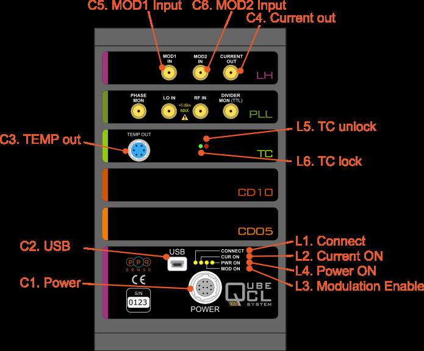

# Editing a mkdocs markdown site

This site uses [MkDocs](https://www.mkdocs.org/) (a static site generator optimized for project documentation). The fundamental content of the site is stored in Markdown text files - a human-readable file format with build-in styling syntax that can be edited in any text editor. Additional styling and functionality comes from CSS and Python extensions. The entire site is hosted directly on github pages and can be exported to a formatted PDF for offline viewing.


## Site Structure
```
.
├── /docs
│   ├── /assets_QubeCL_Manual_v5
│   │   └── /tables
|   |   └── img.png
│   ├── index.md
│   ├── QubeCL_Manual_v5.md   
│   ├── downloads.md
│   ├── /downloads
│   ├── /img
│   └── /javascripts
├── /ppq_theme
│   ├── /css
│   │   └── /img
|   |   └── ppq.css
│   ├── overrides
│   └── partials
├── mkdocs.yml
├── requirements.txt
└── /site
```

- `/docs` contains all the site content (text and images)
    - `/tables` contains csv files that are converted to tables
    - `imgs` - images referenced in markdown document
    - `/downloads` - files available for download from the site (ex. pdf of manual)
    - `downloads.md` - download list
- `/ppq_theme` contains custom styling options for the site (color/font/etc)
- `mkdocs.yml` configuration file (set site settings and enable/modify plugins)
- `requirements.txt` list of dependencies to install for development purposes
- `/site` - mkdocs generated site (do not modify directly)
- `.github/ci.yml` (not shown) configuration file for auto-deploying github site

---

## Editing Content

If you just want to edit or add content to the site, you do not need to install the entire development environment, you can simply modify the desired pages in a text editor (perhaps one with a markdown preview such VSCode in [github online editor](https://github.dev/ppqSense/QubeDocs)).
!!! note "NOTE:" 
    A basic editor will not give you a complete preview of the final site, but is sufficient to add content and confirm basic formatting.


### Create/Edit a page
Each markdown (`.md`) file in the `/docs` directory represents a page on the website. 

### Add new page to site
If you create a new page (ex. `test.md`) and save it in the `/docs` folder, it will be accessable via the url `site.io/<file_name>` but it is *not* automatically added to the site navigation bar, you first need to add it to the navigation structure in the `mkdocs.yml` file for it to be findable by users: (`<Button_Name>: <file_name>`)
```yaml
nav:
  - Home: index.md
  - Qube Manual V5: QubeCL_Manual_v5.md
  - Downloads: downloads.md
```

### Updating the website
- If you are happy with your changes to the documentation and would like to update the site, all you have to do is push your changes to the main github branch in order to automatically update the live version (if you are unsure of your changes, please save them in an un-listed `.md` file or push to a new branch)

**Pushing to Github**
[(See Git Guide for beginners)](https://github.com/git-guides)

- **Option A: From Github editor: (Easier)**
  

- **Option B: From your local machine: (more accurate preview)**
    1. [Setup your computer's ssh-key](https://docs.github.com/en/authentication/connecting-to-github-with-ssh/adding-a-new-ssh-key-to-your-github-account)
    2. Follow best-practices with pushing and pulling to Github (via cmd terminal)
       1. `git fetch` / `git pull` - make sure your local version is up to date
       2. `git branch` - check you are on main branch
       3. `git status` - see which files you've changed
       4. `git add <files>` - add files
       5. `git commit -m "description of changes"` - change message
       6. `git push` - push changes and update site
       7. `git status` / `git log` - confirm changes were saved

!!! note "Note"
    Every time the site is updated, a downloadable PDF version of the entire site is generated and available for download from the download page (currently it is saved at QubeCL Manual V5, but that can be changed). At any time, if you would like to save a version of the site and manual, you can simply save the desired `.md` file along with its assets folder and PDF. By saving it under a new name, the PDF can be added to the download page as a dated version of the manual

---

## Markdown Guides
- Basic Getting Started Guide to Markdown
- Getting started in [mkdocs](https://www.mkdocs.org/user-guide/writing-your-docs/) flabor of markdown


- Embedding an image
- Adding a Table
- Referencing a Figure
- 

---

## Useful plugins/extensions/tools

### abmonition
Allows the user to add colorful callouts/notes/drop-downs to the main text

### tables

Build a correctly-formatted table using a table generator:

https://vikcch.github.io/markdown-table-generator/

You can add a csv file to the `/docs` folder and have it be auto-generated by the python `mkdocs-table-reader-plugin` (less formatting control but good for large datasets that might be modified regularly)

To use enter in markdown: `\{\{ \read_csv(\'path_to_table.csv') \}\}`

### markdown_katex

Use latex-style math notation in your markdown like so:

Inline KaTeX...

>\$\`a^2+b^2=c^2\`\$.

...looks like this: $`a^2+b^2=c^2`$.

Multi-line KaTeX block...

>\```math
>f(x) = \int_{-\infty}^\infty
>
>\hat f(\xi)\,e^{2 \pi i \xi x}
>
>\,d\xi
>
>\```

...looks like this:

```math
f(x) = \int_{-\infty}^\infty
\hat f(\xi)\,e^{2 \pi i \xi x}
\,d\xi
```

### caption

Create a Caption and a tag of a table or image like so:
`<Table/Figure>: <Description> {#tag} ` 
and leave a space between the caption line and the figure/table.

Ex:

> Table: Power source voltages specifications{#pwr_specs}
> 
> |DC Input |minimum |typical | maximum |
> |---|---|---|---|
> | LAS | +20 V | +24 V | +30 V | 
> | TEC | +8 V | +12 V | +24 V |  
>

Table: Power source voltages specifications{#pwr_specs}

|DC Input |minimum |typical | maximum |
|---|---|---|---|
| LAS | +20 V | +24 V | +30 V | 
| TEC | +8 V | +12 V | +24 V |  

or

>Figure: QubeCL15TP front panel
>
>{#front_panel}

Figure: QubeCL15TP front panel

{#front_panel}

(Note that square brackets are blank - this allows for the figure or table number to be auto-generated when figure tag (`(#front_panel)`)) is referenced.

And reference it like so:

> A schematic view of the front panel of the QubeCL can be seen in []> (#front_panel)].


### to-pdf
Whenever the site is rebuilt (re-deployed to github)

## Advanced Features

Local Preview and 

### Additional features that may be added
- automatic figure table generation
- automated versioning
- 