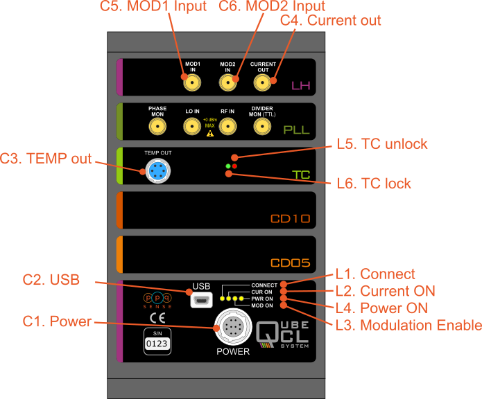

# Reference for Site Editors

## Introduction
This site uses [MkDocs](https://www.mkdocs.org/) (a static site generator optimized for project documentation). The fundamental content of the site is stored in **Markdown** text files (a human-readable file format with build-in styling syntax) that can be edited in any text editor. 

Additional styling and functionality comes from the chosen theme [Material for MkDocs](https://squidfunk.github.io/mkdocs-material/) and its [plugins](https://squidfunk.github.io/mkdocs-material/plugins/), CSS, and [Python extensions](https://python-markdown.github.io/extensions/). The entire site is hosted directly on [github pages](https://docs.github.com/en/pages) and can be exported to a formatted PDF for offline viewing.

## Site Structure
```
.
├── /docs
│   ├── /QubeCL_Current_Manual
    |   ├── QubeCL_Manual_v5.md
│   │   ├── /assets_QubeCL_Manual_v5
│   │   │   └── /tables
│   |   |   └── imgs.png
│   ├── index.md
│   ├── QubeCL_Manual_v5.md   
│   ├── downloads.md
│   ├── /downloads
│   ├── /img
│   └── /javascripts
├── /ppq_theme
│   ├── /css
│   │   └── /img
|   |   └── ppq.css
│   ├── overrides
│   └── partials
├── mkdocs.yml
├── requirements.txt
└── /site
```

- `/docs` contains all the site content (text and images)
    - `/QubeCL_Current_Manual` contains all files relating to Qube Manual
        - `QubeCL_Manual_v5.md` main markdown document of manual
        - `/assets_QubeCL_Manual_v5` contains all assets for Qube Manual v5
            - `/tables` contains csv files that are converted to tables in markdown
      - `/img` - images referenced in multiple site pages (ex. logo)
    - `/downloads` - files available for download from the site (ex. pdf of manual)
    - `downloads.md` - download list page
- `/ppq_theme` contains custom styling options for the site (color/font/etc)
- `mkdocs.yml` configuration file (set site settings and enable/modify plugins)
- `requirements.txt` list of dependencies to install for development purposes
- `/site` - mkdocs generated site (do not modify directly)
- `.github/ci.yml` (not shown) configuration file for auto-deploying github site

---

## Editing Content

If you just want to edit or add content to the site, you do not need to install the entire development environment, you can simply modify the desired pages in a text editor (perhaps one with a markdown preview such VSCode in [github online editor](https://github.dev/ppqSense/QubeDocs)) or directly on the main github site for small changes.
!!! note "NOTE:" 
    A basic editor will not give you a complete preview of the final site, but is sufficient to add content and confirm basic formatting. 

{#gitdirect}


If you want to see a complete preview of the site before update, or if you would like to edit the styling or make additions to the plugins used in the site, please follow the intructions in the [Advanced Features](#advanced-features) section.

## Create/Edit a page
Each markdown (`.md`) file in the `/docs` directory represents a page on the website. 

### Add new page to site
If you create a new page (ex. `test.md`) and save it in the `/docs` folder, it will be accessable via the url `site.io/<file_name>.html` but it is *not* automatically added to the site navigation bar. To add it to the site nav, you first need to add it to the navigation structure in the `mkdocs.yml` file for it to be findable by users. Give the button a name and list the file path starting in docs: (`<Button_Name>: <filepath/file_name>`)
```yaml
nav:
  - Home: index.md
  - Qube Manual V5: QubeCL_Current_Manual/QubeCL_Manual_v5.md
  - Downloads: downloads.md
```

### Updating the website

If you are happy with your changes to the documentation and would like to update the site, all you have to do is `commit` and `push` your changes to the main github branch in order to automatically update the live version.

If you have made changes directly to a single page at a time in github, all you have to do is save by selecting `commit changes` in the [Github browser](#gitdirect).

If you are working locally or in a github code environment, you will have to follow a couple more steps to conform to git version control (See [pushing to github](#pushing-to-github))

!!! note "Saving incomplete work"
    (if you are unsure of your changes, or if they are incomplete, please save them in an un-listed `.md` file or push to a new branch while working).      


### Saving PDF Versions

Every time the site is updated, a downloadable PDF version of the entire site is generated and available for download from the download page (currently it is saved as QubeCL_Manual.pdf, but that can be changed). At any time, if you would like to save a version of the site and manual, you can simply save the desired `.md` file along with its assets folder and PDF. By saving it under a new name in the `/docs/downloads` folder, the PDF can be added to the download page as a dated version of the manual.

!!! note "Disabling PDF Generation"
    PDF generation can take up to 30 seconds each time. Disable during testing by following instructions in [to-pdf plugin](#To-pdf) section.
    


### Pushing to Github
If you are completely new to git:
[(See Git Guide for beginners)](https://github.com/git-guides)

- **Option A: From Github editor: (Easier)**
  - Make your changes
  - navigate to the git branch icon on the left
  - write a descriptive message of your changes
  - hit enter and follow instructions to push to main
  

- **Option B: From your local machine: (Advanced)**
    1. [Setup your computer's ssh-key](https://docs.github.com/en/authentication/connecting-to-github-with-ssh/adding-a-new-ssh-key-to-your-github-account)
    2. Clone down the repository
    3. Follow best-practices with pushing and pulling to Github (via cmd terminal)
       1. `git fetch` / `git pull` - make sure your local version is up to date
       2. `git branch` - check what branch you are on
       3. If necessary, switch branch with `git switch -c <new branch name>` or `git checkout <remote branch name>`
       4. Make your desired changes on desired branch (edit `main` if wanting to immediately update site)
       5. `git status` - see which files you've changed
       6. `git add <files>` - add files
       7. `git commit -m "description of changes"` - change message
       8. `git push` - push changes to Github
       9. `git status` / `git log` - confirm changes were saved
    4. If you pushed directly to `main`, your changes will automatically be reflected on the site. If you pushed to another branch, you can continue to edit and push to that branch until you are ready to update the site.
       1. When ready to update the site, follow [Github instructions](https://docs.github.com/en/pull-requests/collaborating-with-pull-requests/proposing-changes-to-your-work-with-pull-requests/creating-a-pull-request) to make a `pull request` and merge your branch into `main`
   

---

## Guide to using markdown

Markdown is a simple text formatting language akin to HTML that has been widely adopted in recent years, particularly for documentation (github READMEs for example are markdown by default). It is extensible via tools such as mkdocs, python-markdown-extensions and many others, while also being leggible in a standard text editor.

### Some useful resources:
- Basic [Getting Started Guide](https://www.markdownguide.org/getting-started/) to Markdown
- Getting started in [mkdocs](https://www.mkdocs.org/user-guide/writing-your-docs/) flavor of markdown (additional built-in features)

### Common tasks requiring more than text and structure syntax
- Embedding an image:
   > ```text
   > [Description of Image](/path/to/image/from/docs.png){#image-tag}
   > ```

- Adding a Table:
Building a table in markdown is similar to LaTeX. You must draw out the columns and rows which can be tedious.

```text
|   H1   |   H2   |   H3   |
|--------|--------|--------|
|      1 |      2 |      3 |
|      4 |      5 |      6 |
```

Becomes:

Table: Example Table{#figure-of-choice}

|   H1   |   H2   |   H3   |
|--------|--------|--------|
|      1 |      2 |      3 |
|      4 |      5 |      6 |


Build a correctly-formatted table a bit quicker using a [table generator site](https://vikcch.github.io/markdown-table-generator/)

Or use the [tables extension](#tables-extension) to import from CSV.


- Referencing an anchor:
  You can create an anchor point to a header, figure, table, or piece of text by adding {#anchor-name} to the end of it. and link to it by using [this](#anchor-name) syntax:
  
  ```text
  [this](#anchor-name)
  ```

  This works even across pages if you include the page's file path from your current location before the hashtag.
  
   `[this](../QubeCL_Current_Manual/QubeCL_Manual_v5.md#pwr_specs`

   becomes....

   [this](../QubeCL_Current_Manual/QubeCL_Manual_v5.md#pwr_specs)


  If you have a figure or a table that was created using the [caption](#caption-extension) extension, you can leave the square brackets blank when referencing it and the correct table or figure number will be populated instead.

   `[](#figure-of-choice)`

   becomes....
  [](#figure-of-choice)

---

## Useful plugins/extensions/tools
Additional functionality has been added to this site via various python extensions. You can access these features by using the correct syntax described below.

To see a full list of built-in plugins and supported extensions visit: [mk-material plugins](https://squidfunk.github.io/mkdocs-material/plugins/), and [Python Markdown extensions](https://python-markdown.github.io/extensions/) pages.

### Abmonition
Allows the user to add colorful callouts/notes/drop-downs to the main text:

> ```text
> !!! note "Like This"
>     Put your message here
> ```

!!! note "Like This"
    Put your message here

See [Admonition Plugin](https://python-markdown.github.io/extensions/admonition/) page for more examples.

### Autoref

Allows you to reference headers by name without creating anchor tags ex. `[Link Description](#Autoref)`.

[Link Description](#Autoref) should take you to this subsection.


### Tables

This plugin allows for the insertion of tables in a more programmatic way.


You can add a csv file to the `/docs` folder and have it be auto-generated by the python `mkdocs-table-reader-plugin` (less formatting control but good for large datasets that might be modified regularly)

To use enter in markdown: 
```text

\{{ read_csv('path_to_table.csv') }\}

```


### Markdown_katex

Use latex-style math notation in your markdown like so:

Inline KaTeX...

```text
$`a^2+b^2=c^2`$.
```

...looks like this: $`a^2+b^2=c^2`$.

Multi-line KaTeX block...

```text
  ```math
  f(x) = \int_{-\infty}^\infty
  \hat f(\xi)\,e^{2 \pi i \xi x}
  ,d\xi
  ```
```
...looks like this:

```math
f(x) = \int_{-\infty}^\infty
\hat f(\xi)\,e^{2 \pi i \xi x}
\,d\xi
```

### Caption 

Create a Caption and a tag of a table or image like so:
`<Table/Figure>: <Description> {#tag} ` 
and leave a space between the caption line and the figure/table.

Ex:

```text
Tablè: Power source voltages specifications{#pwr_specs}

|DC Input |minimum |typical | maximum |
|---|---|---|---|
| LAS | +20 V | +24 V | +30 V | 
| TEC | +8 V | +12 V | +24 V |
```

becomes: 

Table: Power source voltages specifications{#pwr_specs}

|DC Input |minimum |typical | maximum |
|---|---|---|---|
| LAS | +20 V | +24 V | +30 V | 
| TEC | +8 V | +12 V | +24 V |  

or

```text
{#front_panel}
```

becomes:
{#front_panel}

(Note that square brackets are blank - this allows for the figure or table number to be auto-generated when figure tag (`(#front_panel)`) is referenced.

And reference it like so:
```text
A schematic view of the front panel of the QubeCL can be seen in [](#front_panel).
```

A schematic view of the front panel of the QubeCL can be seen in [](#front_panel).

### To-pdf
Whenever the site is rebuilt  (`mkdocs serve` or `mkdocs build`) it is saved in a pdf format to the downloads folder. This takes a few seconds. If you are testing locally and don't want to regenerate it each time, you can suppress this feature by uncommenting the following line in the `mkdocs.yml` (remember to comment out when done editing).

```text
  - to-pdf: # enable to auto-generate PDF download(currently for whole site)  
      ...
      enabled_if_env: ENABLED_PDF_EXPORT #uncomment this line to 
```

---

## Advanced Features

### Comprehensive Site Editing

To edit the styling or functionality of the site, it is best develop on a fully functional local version (before updating the live site). 

If you don't already know how to use github, follow the [readme](https://github.com/ppqSense/QubeDocs) instructions to setup your local environment. 

!!! note "Github Codespaces"
    You can also use the live codespace editor in github instead of your local machine for development. See the (Codespaces Quickstart guide)[https://docs.github.com/en/codespaces/quickstart] for more information.


You can reach the live editor from your browser by changing the url of the project from `github.com/ppqSense/QubeDocs/` to `github.dev/ppqSense/QubeDocs/` and setting up a GitHub Codespace by opening up the terminal and selecting "Continue Working in GitHub Codespaces". From here you can follow the rest of the instructions as you would locally.

### Local Preview
While in a `Python3` virtual environment & the main project directory run:

   1. `pip install -r requirements.txt` to install all dependencies (do once)
   2. Run `mkdocs build` to build out site structure and styling
   3. Run `mkdocs serve` to serve a live test site 
      - Navigate to provided URL to see site
   
### Local Editing Tips
- Changes to content should be reflected automatically upon save if `mkdocs serve` is running.
- `mkdocs build` must be re-run upon changes to styling or plugins.
- Any changes to the python environment (addition of extensions, etc.) should be reflected in the requirements.txt file. This can be updated with the following command from the main directory:
  -  `pip freeze > requirements.txt` (do before pushing changes)
    - This is important to make sure that other editors can correctly setup their environment for testing.

## Proposed Edit, Review, & Approve Workflow


### Additional features that may be added later
- automatic "table of figures" generation
- automated versioning
- multiple PDF file generation (generate static version of multiple seperate pages)

## Markdown Experimentation

*(Feel free to add/experiment here in this section)*

```text
---
# Header 1
## Header 2
### Header 3
*italics*
**bold**
> quote
---
```
**Becomes...**
---
# Header 1
## Header 2
### Header 3
*italics*
**bold**
> quote
---